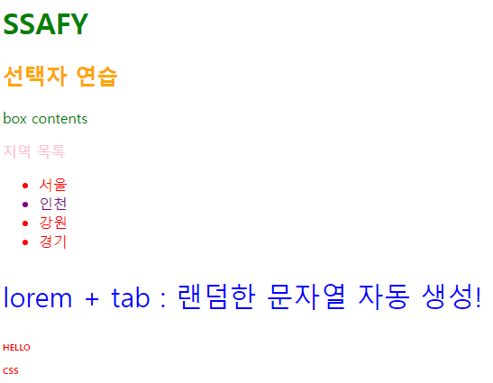
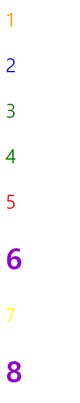

# CSS

## Cascading Style Sheets

- OOP 에서 태그가 중첩될 수 있는 것처럼
- 우리가 작성한 코드의 태그끼리도 상속되고 중첩되고 계단형식
- **스타일을 지정하기 위한 언어**
- HTML 이 태그 속성(별명)을 적어둔 걸 CSS에서 선택하고 스타일을 지정함

```css
h1 { 
	color:blue;
	font-size : 15px;
}
```

- `h1` : 선택자 / `font-size`  : 속성 / `15px` : 값
- 선택자를 통해 스타일을 지정할 HTML 요소 선택
- 속성 - 값의 페어로 적용됨

## CSS 정의 방법

- 인라인 `<a style = "font-size : 15px"></a>`
- 내부 참조 : `<style>`
- **외부 참조 : 분리된 CSS 파일 → 가장 많이 쓰는 방식**

## 인라인(Inline)

- 해당 태그에 직접 style 속성 활용

```html
<body>
    <h1 style="color : blueviolet; font-size: 100px;"></h1>
    <h1></h1>
    <h1></h1>
    <h1></h1>
    <h1></h1>
</body>
</html>
```

## 내부 참조

```html
<head>
    <meta charset="UTF-8">
    <meta http-equiv="X-UA-Compatible" content="IE=edge">
    <meta name="viewport" content="width=device-width, initial-scale=1.0">
    <title>Document</title>
    <style>
        h1 {
           color : red;
           font-size : 40px; 
        }
    </style>

</head>
```

- 모든 `<h1>` 태그의 속성 변경
- `<head>`에 `<style>` 통해서 사용

## 외부 참조

- 작성하는 HTML 파일과 외부의 CSS 파일을 연결해야 한다
- `<link rel>` `<href:외부 파일 링크연결>`

```html
<head>
    <meta charset="UTF-8">
    <meta http-equiv="X-UA-Compatible" content="IE=edge">
    <meta name="viewport" content="width=device-width, initial-scale=1.0">
    <title>Document</title>
    <link rel="stylesheet" href="mystyle.css">
</head>
<body>
		<h1>This is my site</h1>
</body>
```

```css
/* mystyle.css */
h1 {
	color: blue;
	font-size: 20px;
}
```

# CSS Selectors

- 수많은 요소들 가운데 원하는 것 고를 수 있음
- 특정 조건에 맞도록 해서 여러 가지를 고를 수도 있음

## 선택자 유형

- **기본 선택자**
    - 전체 선택자, 요소 선택자
    - 클래스, 아이디, 속성 선택자
- **결합자(Combinators)**
    - 자손 결합자(*할아버지의 자손은 자식, 손자를 모두 포함)*
    - 자식 결합자*(부모의 자식은 그 자식만 포함)*
    - 일반 형제 결합자, 인접 형제 결합자
- 의사 클래스/요소

```css
/* 전체 선택자 */
* {
    color : red;
}

/* 요소 선택자 */
h2 {
    color: orange;
}

h3,
h4 {
    font-size: 10px;
}

/* 클래스 선택자 */
.green {
    color: green;
}
/* 아이디 선택자 */
#purple {
    color: purple;
}
/* 자손 결합자 */
.box p {
    color: pink;
}
/* 자식 결합자 */
.box > p {
    color: blue;
    font-size:30px;
}
```

```html
<body>
    <h1 class="green">SSAFY</h1>
    <h2>선택자 연습</h2>
    <div class="green box">
        box contents
        <div>
            <p>지역 목록</p>
            <ul>
                <li>서울</li>
                <li id="purple">인천</li>
                <li>강원</li>
                <li>경기</li>
            </ul>
        </div>
        <p>lorem + tab : 랜덤한 문자열 자동 생성!</p>
    </div>
    <h3>HELLO</h3>
    <h4>CSS</h4>
</body>
```

- 결과
    

    

## CSS 선택자 정리

- **요소 선택자** : HTML 태그를 직접 선택
- **클래스 선택자** : `.`최씨, 김씨
- **id 선택자** : `#` 이름 *웬만하면 잘 안 겹치는 종류(클래스보다 덜 겹침)*
    - 일반적으로 하나의 문서에 1번만 사용
    - 여러 번 사용해도 가능하나 단일 id 사용 권장
- 전체 선택자 : `*`

## CSS 적용 우선순위

- `!important` 가장 높은 우선순위 : 사용빈도 ↓
- 인라인 > id > class, 속성 > 요소
- 등급이 같다면 **아래쪽에 있는 선택자**가 우선순위가 높음
- 요소 < 클래스 < 아이디 : **범위가 좁아질수록 우선순위가 높아짐**
    - 인라인 선택자 > <style> 태그에 작성하는 것보다 높음
- 요소들은 계단식으로 합쳐지게 됨( 위-아래로 영향 받음 )
- 자손 결합자 : `box p` → 박스 클래스 안의 p 태그

## ★☆★ Quiz 예시 ★★★

```html
<!DOCTYPE html>
<html lang="en">
<head>
    <meta charset="UTF-8">
    <meta http-equiv="X-UA-Compatible" content="IE=edge">
    <meta name="viewport" content="width=device-width, initial-scale=1.0">
    <title>Document</title>
    <style>
        h2{
            color : darkviolet !important;
        }

        p{
            color:orange;
        }
        .blue{
            color:blue;
        }
        .green {
            color:green;
        }
        #red {
            color:red;
        }
    </style>
</head>
<body>
    <p>1</p>
    <p class="blue">2</p>
    <p class="blue green">3</p>
    <p class="green blue">4</p>
    <p id="red" class="blue">5</p>
    <h2 id="red" class="blue">6</h2>
    <p id="red" class="blue" style="color:yellow;">7</p>
    <h2 id="red" class="blue" style="color:yellow;">8</p>
</body>
</html>
```

- 결과
    


3,4 의 경우 : green  클래스가 더 아래쪽에 있기 때문에 우선순위가 ↑
    

## CSS 상속

- 상속을 통해 부모 요소의 속성을 자식에게 상속
- 상속 되는 것 : Text 관련 요소 `text`, `color`, `text-align`, `opacity`, `visibility`
- 상속 안 되는 것 : 여백, 레이아웃 관련 요소 `width` `height` `padding` `margin`, `position`

```html
<style>
    p {
        /* 상속됨 */
        color : red;
        /* 상속 안됨 */
        border : 3px solid black;
    }
</style>

</head>
<body>
    <p>안녕하세요 <span>테스트</span>입니다. </p>
</body>
```

## 크기 단위

- px(픽셀)
    - 고정되어 있으므로, 화면의 크기가 달라져도 고정됨
- %
    - 가변적인 레이아웃에서 자주 사용
- **em**
    - (바로 위, 부모 요소에 대한) 부모 크기에 대해서, 부모 요소에 대해서 상속의 영향 받음
    - *부모 크기의 0.5배*
- **rem**
    - 최상위 요소 사이즈를 기존으로 배수 단위를 가짐
    - *브라우저마다 존재하는 기본 글자*를 기준으로 함

```html
<!DOCTYPE html>
<html lang="en">
<head>
    <meta charset="UTF-8">
    <meta http-equiv="X-UA-Compatible" content="IE=edge">
    <meta name="viewport" content="width=device-width, initial-scale=1.0">
    <title>Document</title>
    <style>
        .font-big {
            font-size:70px;
        }
        .em {
            font-size:0.5em;
        }
        .rem {
            font-size:2rem;
        }
    </style>
</head>
<body>
    <ul class="font-big">
        <li class="em">2em</li>  <!-- 35px -->
        <li class="rem">2rem</li> <!-- 32px -->
        <li>no class</li>
    </ul>
</body>
</html>
```

### viewpoint

- 웹 페이지를 방문한 유저에게 바로 보이게 되는 웹 컨텐츠의 영역
- 디바이스의 viewpoint를 기준으로 상대적 사이즈 결정
- `vw`, `vh`, `vmin`, `vmax`
- `px` 크기 변경해도 그대로
- `vw` 브라우저 크기에 따라 크기가 변함

## 색상 단위

- 색상 키워드
    - 대소문자 구분하지 않음
    - `red`, `black`, `pink`
- RGB 색상(`background-color : rgb(0, 255, 0);`)
    - `#`+16진수로 표현
- HSL 색상(`background-color : hsl(0, 100%, 50%);`)
    - 색상, 채도, 명도
- a는 alpha(투명도) : `rgba`

```css
/* 가장 많이 사용 */
p { color : black; }
p { color : #000000; }
```

## CSS 문서 표현

- 텍스트
    - 서체, 서체 스타일, 자간, 단어 간격, 행간
- 컬러, 배경
- 기타 HTML 태그별 스타일링
    - 목록(`li`), 표(`table`)
    

## 결합자 (Combinators)

- **자손 결합자(공백)**
    - selector A 하위의 **모든** 요소 selector B 요소
    - `div span` : div 태그 안에 있는 모든 span 태그
    
```css
div span {
    color : red;
}
```

```html
<div>
    <span>이건 빨강입니다.</span>
    <p>이건 빨강이 아닙니다.</p>
    <p>
        <span>이건 빨강입니다.</span>
    </p>
</div>
```

- **자식 결합자(`>`)**
    - selector A 바로 아래의 selector B 요소
    - `div > span` : div **바로 밑**의 span 요소(내부에 <p>태그 안의 span 요소는 X)
    
```css
div > span {
    color : red;
}
```

```html
<div>
    <span>이건 빨강입니다.</span>
    <p>이건 빨강이 아닙니다.</p>
    <p>
        <span>이건 빨강이 아닙니다.</span>
    </p>
</div>
```
    
- 일반 형제 결합자(`~`)
    - selector A의 형제 요소 중 뒤에 위치하는 selector B 요소를 모두 선택
    - `p ~ span` 같은 레벨에 있는 것 중에 p 뒤에 있는 span 태그
    
```html
<body>
    <span>p태그 앞에 있기 때문에 이건 빨강이 아닙니다.</span>
    <p>여기 문단이 있습니다.</p>
    <b>그리고 코드도 있습니다.</b>
    <span>p태그와 형제이기 때문에 이건 빨강입니다!</span>
    <b>더 많은 코드가 있습니다.</b>
    <span>이것도 p태그와 형제이기 때문에 빨강입니다!</span>
</body>
```

- 인접 형제 결합자(`+`)
    - selector A의 형제 요소 중 바로 뒤에 위치하는 selector B 요소만 선택
    - `p + span` 같은 레벨에 있는 것 중 p **바로 뒤**에 있는 span 태그
    
```html
<body>
    <span>p태그 앞에 있기 때문에 이건 빨강이 아닙니다.</span>
    <p>여기 문단이 있습니다.</p>
    <span>p태그와 인접한 형제이기 때문에 이건 빨강입니다!</span>
    <b>더 많은 코드가 있습니다.</b>
    <span>p태그와 인접한 형제가 아니기 때문에 이건 빨강이 아닙니다.</span>
</body>
```


# CSS Box Model

## CSS의 모든 것은 박스다

- 모든 요소는 네모(박스모델)이고,
- 위에서 아래로 ↓
- 왼쪽에서 오른쪽으로 쌓인다 →
- 좌측 상단에 배치

## CSS 원칙 1

- `inline` 요소는 왼쪽에서 오른쪽
- `block` 요소는 위에서 아래


## Box model 구성

- margin : 테두리 바깥의 외부 여백
    - 테두리 바깥부터 다른 요소와의 사이 공간
    - 배경색 지정 불가
- border : 테두리 영역
    - shorthand : `width` - `style` - `color`
- padding : 테두리 안쪽의 내부 여백
    - 안쪽의 내부 여백
- content : 글이나 이미지 등 요소의 실제 내용


### shorthand(margin/padding)

- margin : 전체
- margin : 10px 20px → 상하 좌우
- margin : 10px 20px 30px → 상 좌우 하
- margin : 10px 20px 30px 40px → 상 우 하 좌 **(시계방향)**

## box-sizing

- 모든 요소의 box-sizing 은 content-box
    - Padding을 제외한 순수 contetns영역만을 box로 지정
- 우리는 border까지의 너비를 100px로 보는 것을 원함
    - 이 경우 box-sizing을 border-box로 설정

# CSS Display

## CSS 원칙 2

- 모든 요소는 네모이고, 좌측상단 배치
- **display에 따라 크기와 배치가 달라진다**

## display

- display : `block`
    - 줄 바꿈이 일어나는 요소
    - 화면 크기 전체의 가로 폭 차지, **한 줄 다 차지**
    - *div, ul, ol, li, p, hr, form*
- display : `inline`
    - 줄 바꿈이 일어나지 않는 행의 일부 요소
    - content 너비만큼만 가로 폭 차지
    - 여백 지정 불가 `width` `height` X
    - 상하 여백은 line-height로 지정 ← **글자로 취급**하기 때문에
    - *span, a, img, input, label, b, em, i, strong*
- display : `inline-block`
    - `inline`처럼 컨텐츠 너비만큼 가로 차지
    - `block`처럼 여백 지정 가능 `width` `height` O
- display : `none`
    - 화면 상에 나타나지도 않고 위치도 차지하고 있지도 않음
    - *visibility : hidden → 실제로 보이지는 않지만 숨어 있음, 쌓여있으나 눈에는 보이지 않음, 처음에 숨겼다가 나중에 보여줄 일이 있다면 hidden 사용*
    

## 속성에 따른 수평 정렬

- 글자 정렬할 때, 글자에 text-align 쓸 게 아니라 부모 요소에 text-align 사용해야 함
    - 글자는 inline이라서 이미 글자(content)만큼 범위를 차지하고 있기 때문
- margin-right : auto → 오른쪽에 자동으로 여백
- margin-left : auto → 왼쪽에 자동으로 여백
- margin : auto → 양쪽에 자동 여백, 자동으로 가운데 정렬
- block 요소 내부의 inline 요소에만 사용 가능
    - text-align : left, right, center…
    

# CSS Position

- 레이아웃 결정 시 사용
- 태그 박스들의 위치를 변경하고 싶을 때
- `static` : 모든 태그의 기본 값(기본 위치)
- `relative` : 상대 위치
    - 자기 자신의 static 위치를 기준으로 이동(normal flow 유지)
    - 내가 있어야 할 곳에서 움직이는 것
    - **실제 위치는 그대로, 사람 눈에만 이동하는 것처럼 보임**
- `absolute` : 절대 위치
    - 브라우저 화면 기준으로 이동
    - 요소를 일반적 문서 흐름에서 제거 후 레이아웃에 공간을 차지하지 않음
    - **원래 자기가 있어야 할 곳에 위치를 차지 하지 않게 됨**
    - 부모 중에 static이 아닌 요소를 찾아서(relative) 거기를 기준으로 위치
    - relative가 없다면 브라우저 기준
- `fixed` : 고정 위치
    - 화면 기준으로 위치 지정
    - 스크롤 시에도 항상 같은 위치
- `sticky` : 스크롤에 따라 static → fixed로 변경
    - 기본적으로 static 인데 스크롤을 내리면 따라서 위치가 변경됨