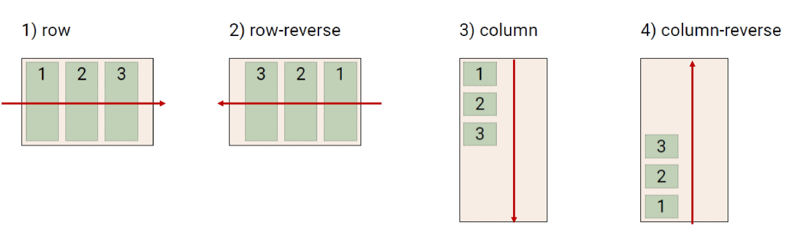

# CSS Layout

- float : 예전
- flexbox : 최근
- grid

---


# CSS Layout techniques

- Display
- Position
- **Float** ; 원래 Layout 용도는X
- **Flexbox**
- **Grid**
- 기타 : Responsive Web Design, Media Queries ; 스마트폰, 태블릿 디바이스 적용되는 반응형 페이지

## CSS 원칙1


- CSS의 보통 흐름(Normal Flow)
- `inline` : 좌측 상단부터 글자 써지듯이 오른쪽으로
- `block`: 좌측 상단부터 레고 쌓이듯이 아래쪽으로
- **모든 요소는 네모(박스모델)이고, 위에서 아래로, 왼쪽에서 오른쪽으로 쌓인다**

## Float

- 박스를 왼쪽 혹은 오른쪽으로 이동 시켜 텍스트를 포함 `inline` 요소들이 주변을 흐르게 하도록 함 *감싸면서 흐르게 만들기 → normal flow 벗어남*
- `none` : 기본값
- `left` : 요소 왼쪽으로 띄움, 평면상에서 z축으로 뜨게 됨
- `right` : 요소 오른쪽으로 띄움
    
    ```css
    /* float를 하나에만 적용하고 싶을 때 */
    /* 다른 게 영향받지 않게 하고 싶을 때 */
    .clearfix::after {
    	content:"";
    	display: block;
    	clear:both
    }
    ```
    

## Flexbox

- 행과 열(가로세로) 형태로 아이템을 배치하는 1차원 레이아웃 모델
- 꼬치의 방향부분이 유일하게 들어가는 입구라고 생각, FILO(First In Last Out)
- `flex-direction`
    - `row`(기본값),
    - `column`(세로 배열)
    - `row-reverse`(행(가로) 배치 거꾸로)
    - `column-reverse`(열(세로) 배치 거꾸로)
- `main-axis` : 막대기의 방향
- `cross-axis` : main의 수직 방향 교차 축
- 구성 요소
    - `Flex Container`(**flex는 부모요소에 적용시켜야 함**)
    - `Flex item`
- `inline-flex` → 부모 요소에 적용됨
    - 자식요소가 inline이 되는게 아니라 부모 요소가 inline이 되는 것

> `*display: inline-flex`does not make flex items display inline. It makes the flex container display inline. That is the only difference between `display: inline-flex` and `display: flex`. A similar comparison can be made between `display: inline-block`and `display: block`*
> 

> ***inline :** Any height and width properties will have no effect. `span` `a` `img` `em` `strong`*
> 
> 
> ***inline-block :*** *can set height and width values.*
> 
> ***block :** `div` `h1` `p` `li` `section`*
> 

## Flex 속성

- 배치 설정 : `flex-direction`, `flex-wrap`
- 공간 나누기 : `justify-content`(main axis), `align-content`(cross axis)
    - item을 넣고 남는 공간을 어떻게 나눌 것인가
    - 전체 공간에서 일정한 간격만큼 배치하려고 할 때 고려
- 정렬 : `align-items`, `align-self`

## 배치 설정

### flex-direction

- `main axis`기준 방향 설정
- 역방향의 경우 HTML 태그 선언 순서와 시각적으로 다르니 유의
- `row-reverse` : ~~최신글 설정할 때(가장 마지막 item이 상위 배치)~~



### flex-wrap

- 아이템이 컨테이너를 벗어나는 경우 해당 영역 내에 배치되도록 설정
- 기본적으로 컨테이너 영역을 벗어나지 않도록 함
- `nowrap` : 무조건 한 줄 배치, 크기를 줄여서라도 같은 줄에 배치 (기본값)
- `wrap` : 넘치면 다음 줄 배치, 원래 크기를 지키고 다음 줄로 넘김
- `wrap-reverse` : 밑에서부터 쌓이는 것, 최신글이 위에 오게 하고 싶을 때

### flex-flow

- `flex-flow : flex-direction flex-wrap`
- 두 가지 설정 값을 차례로 작성
- *ex : flex-flow : row nowrap*

## 공간배분

- `flex-start`(디폴트) : 아이템들을 axis 시작점으로
- `flex-end` : axis 끝으로
- `center` axis를 기준으로 가운데로
- `space-between` : 사이 간격 균일하게
- `space-around` : 모든 컨텐츠를 둘러싸고 있는 영역이 동일, 컨텐츠 사이의 영역이 넓음 *실제 여백이 1:2:2:1*
- `space-evenly`: 모든 컨텐츠 간의 간격이 동일

### justify-content

- `main-axis` 기준
- 그림은 현재 메인축이 가로인 상태
- `center` : 가운데 정렬


### align-content

- `cross-axis` 기준
- 컨텐츠가 여러 줄일때만 적용됨


## 정렬

- `stretch` : 전체 높이에 맞춰 늘이기
- `flex-start` : 위
- `flex-end` : 아래
- `center` : 가운데
- `baseline`: 글자 라인에 맞춰서 정렬

### align-items

- 모든 아이템을 `cross axis`(**메인 축의 수직 방향**) 기준으로 정렬
- `center` **: 가운데 줄로 정렬**
- `baseline` : 글자 선을 기준으로 맞추기


> *The `align-items` property of flex-box aligns the items inside a flex container along the cross axis just like `justify-content` does along the main axis. (For the default `flex-direction: row` the cross axis corresponds to vertical and the main axis corresponds to horizontal. With `flex-direction: column` those two are interchanged respectively). But `align-content` is for multi line flexible boxes. It has no effect when items are in a single line. It aligns the whole structure according to its value.*
> 
> 
> ⇒ *`align-items` 는 `justify-content` 와 동일하게, 하지만 cross axis에서 동작.* 
> 
> ⇒ *`align-content` 도 cross axis 에서 동작하지만 축에 item이 여러 줄(multi line)일 때 동작.*
> 

### align-self

- 개별 아이템을 `cross axis` 기준으로 정렬
- `flex-start`
- `center`
- `flex-end`


### 기타 속성

- `flex-grow` : 남은 영역(남아 있는 영역이 가로일수도 있고 세로일수도 있음)을 아이템에 분배
    - *flex-grow : 1 → 남은 영역을 1:1로 분배*
    - *여백을 몰아주고 싶을 때 사용*
- `order` : 배치순서변경


> `block` : 위에서 아래로 쌓이고 페이지 너비를 전부 차지하게 됨
> 
> 
> `inline` : 좌에서 우로 컨텐츠가 쌓이고 컨텐츠 만큼의 영역만 차지하게 됨
> 

## flex 속성 중요한 거

1. 배치 관련 설정 : flex-direction, flex-wrap
2. 공간에 대한 설정: justify-content, align-content
3. 정렬에 대한 설정 : align-items, align-self

## 정리

- `flex-direction`에 따라서 main axis가 변경됨
- `main axis`가 변경되면 `cross axis`의 방향도 변경됨
- main axis → `justify content`
- cross axis → `align items`, `align content`
