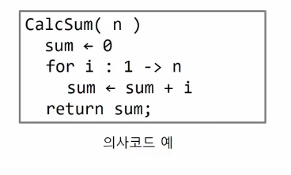
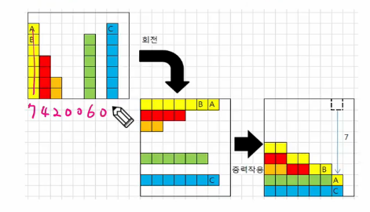
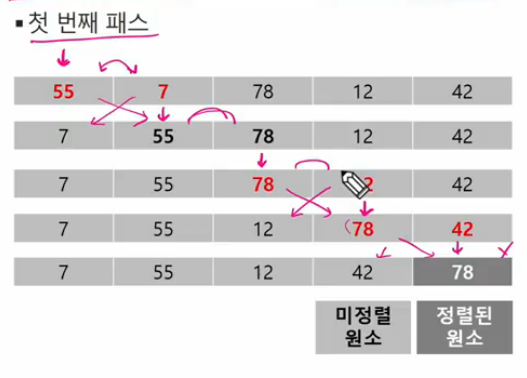
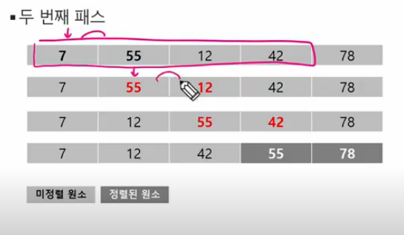
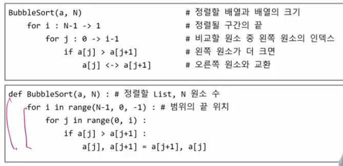
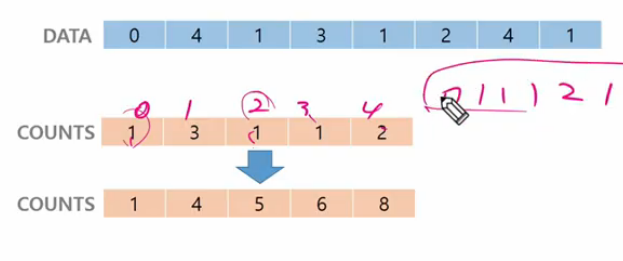
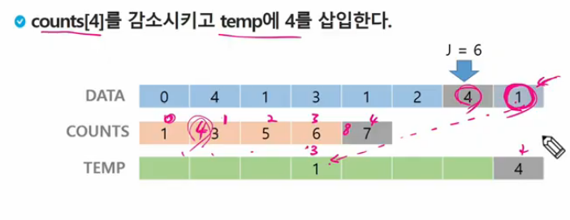
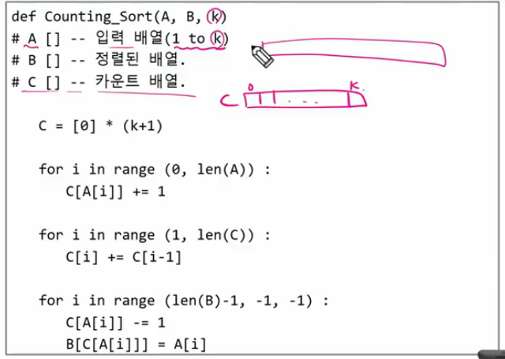

# 배열

- 알고리즘
- 배열
- 버블 정렬 (Bubble Sort)
- 카운팅 정렬 (Counting Sort)
- 완전검색
- 그리디 (Greedy Algorithm)

# 알고리즘

- 유한한 단계를 통해 문제를 해결하기 위한 절차나 방법
- 주로 컴퓨터 용어로 쓰이며,
- 컴퓨터가 어떤 일을 수행하기 위한 단계적 방법
- 어떤 문제를 해결하기 위한 절차

## 알고리즘을 표현하는 방법

- 의사코드(슈도코드, Pseudocode)
    - 코드의 형태를 갖추고 있지만 코드가 아님
    - 문법이 정해져 있는 것은 아님
    - 보통 본인이 사용하는 언어의 형태로 사용
        
        
        
- 순서도


## 알고리즘 성능

- APS 과정의 목표 중 하나는 **보다 좋은 알고리즘을 이해하고 활용하는 것**
- 정답은 존재
- 하지만 코드에는 정답 X
    - 이해하기 쉽고 오류가 잘 나지 않고, 코드로 작성하기 편한…

### 무엇이 좋은 알고리즘인가?

1. 정확성 : 얼마나 정확하게 동작하는가
2. 작업량 : 얼마나 적은 연산으로 원하는 결과를 얻어내는가
3. 메모리 사용량 : 얼마나 적은 메모리를 사용하는가
4. 단순성 : 얼마나 단순한가
5. 최적성 : 더 이상 개선할 여지없이 최적화되었는가
    1. 쓸데 없이 돌아가는 코드가 없는지

- 주어진 문제를 해결하기 위해 여러 개의 다양한 알고리즘 가능

⇒ 그 중에서 어떤 알고리즘을 사용해야 하는가?

- 알고리즘의 성능 분석 필요
    - 많은 문제에서 성능 분석을 기준으로 알고리즘 작업량 비교
- 알고리즘의 작업량을 표현할 때 시간복잡도로 표현한다
- **시간 복잡도(Time Complexity)**
    - 실제 걸리는 시간 측정 → 이렇게 하긴 어려워서 실제로 하진 X
    - 실행되는 명령문의 개수 계산 → 연산이 몇 번 정도 이뤄지는지 대략 계산
    

## 시간 복잡도 = 빅-오(O) 표기법

- 빅-오 표기법(Big-Oh NOtation)
- 시간 복잡도 함수 중에서 가장 큰 영향력을 주는 n에 대한 항만 표시
- 계수는 생략하여 표시
    - `O(3n+2)` = `O(3n)` = `O(n)`
    - `O(2n^2 +10n + 100) = O(n^2)`
    - `O(4) = O(1)`
- *n개의 데이터를 저장 받아 1씩 더 하는 연산의 시간 복잡도는? - O(n)*


## 배열

- 일정한 자료형의 변수들을 하나의 이름으로 열거하여 사용하는 자료구조
    - 문법적으로 자료형을 구분하지는 않지만 내부적으로는 자료형 고려함
- 데이터를 묶음으로 저장하는 방식 ⇒ 배열
- 파이썬에서는 문법적으로 리스트를 사용

## 배열의 필요성

- 프로그램 내에서 여러 개의 변수가 필요할 때 일일이 다른 변수명을 이용하여 자료에 접근하는 것은 매우 비효율적
- 배열을 사용하면 하나의 선언을 통해서 둘 이상의 변수를 선언할 수 있음
- 단순히 다수의 변수 선언만 의미하는 게 아니라, 다수의 변수로는 하기 힘든 작업을 배열을 활용해 쉽게 할 수 있음 ⇒ 100개의 변수로 반복문 시행할 때

## 1차원 배열

### 선언

- 별도의 선언 방법이 없음녀 변수에 처음 값을 할당할 때 생성
- 이름 : 프로그램에서 사용할 배열의 이름

```python
Arr = list()

# 비어 있는 배열
# 실제 배열 내부에 값이 존재하는 것은 아니지만,
# 메모리 주소를 가리킬(참조할) 준비가 되어 있는 상태
Arr = []
Arr = [1, 2, 3]

# 초기화된 배열, 10칸짜리의 비어 있는 배열
# 값이 구체적으로 없음
# 1차원 배열에서만 사용 가능
Arr = [0] * 10 
```

### 접근

```python
Arr[0] = 10 # 배열 Arr이 0번 원소에 10 저장
Arr[idx] = 20 # 배열 Arr의 idx번 원소에 20을 저장하라
```

### 배열 활용 예제 : Gravity

- 상자들이 쌓여있는 방. 방이 오른쪽으로 90도 회전하여 상자들이 중력의 영향을 받아 낙하한다고 할 때, 낙차가 가장 큰 상자를 구하여 그 낙차를 리턴하는 프로그램 작성
- 중력은 회전이 완료된 후 적용
- 상자들은 모두 한쪽 벽면에 붙여진 상태로 2차원의 형태를 이루며 벽에서 떨어져서 쌓인 상자는 없다
- 방의 가로길이는 항상 100, 세로 길이는 항상 100
- #즉, 상자는 최소 0 최대 100 높이로 쌓을 수 있음



```python
# 각 원소에 대해
N = int(input())
arr = list(map(int, input().split()))
maxV = 0 # 첫 원소를 최대값으로 지정
for i in range(0, N): # 나머지 모든 원소에 대해
	if arr[i] > maxV:
		maxV = arr[i]
print(maxV)
```

- 각 원소(`arr[i]`에 대해 오른쪽에 있는 원소 중(`arr[i+1:N]`) 더 작은 원소의 개수 구하기

## 정렬

- 2개 이상이 자료를 특정 기준에 의해 작은 값부터 큰 값(오름차순;*ascending*) 혹은 그 반대의 순서(내림차순;*descending*)대로 재배열하는 것
- 키 : 자료를 정렬하는 기준이 되는 특정 값

### 대표적인 정렬 방식의 종류

- **버블 정렬 (Bubble Sort)**
- 카운팅 정렬 (Counting Sort)
- **선택 정렬 (Selection Sort)**
- 퀵 정렬 (Quick Sort)
- 삽입 정렬 (Insertion Sort)
- 병합 정렬 (Merge Sort)

## 버블 정렬

- 인접한 두 개의 원소를 비교하며 자리를 계속 교환하는 방식
- 가장 간단한 정렬 방식

### 정렬 과정

- 첫 번째 원소부터 인접한 원소끼리 계속 자리를 교환하면서 맨 마지막자리까지 이동함
- 한 단계가 끝나면 가장 큰 원소가 마지막 자리로 정렬
- 교환하며 자리를 이동하는 모습이 물 위에 올라오는 거품 모양과 같다고 하여 버블 정렬

### 시간 복잡도

- O(n^2) : 2중 for문인 경우

### 예시

- [55, 7, 78, 12, 42] 버블 정렬하는 과정 (오름차순)
- 첫 번째 패스가 끝나면맨 마지막에 들어간 값은 주어진 값들 중 가장 큰 값(Max)이 됨
- 이제 나머지 구간에 대해서 같은 작업을 하면 됨
- 새로운 구간이 정해질 때마다 비교해야 할 구간이 줄어듦
- 원소가 2개 남을 때까지 대상을 비교하면 됨(인접 비교라 최소 2개 필요)





### 고려할 점

- 구간의 끝 정하기
    - `for i : N-1 -> 1`
- 비교 대상이 되는 값(인접한 원소 중 왼쪽)
    - `for j : 0 -> i-1`
- 왼쪽이 더 크면 오른쪽으로 이동
    - `if arr[j] > arr[j+1]` ⇒ `arr[j]<-> arr[j+1]`



## 카운팅 정렬

- 항목들의 순서를 결정하기 위해 집합에 각 항목이 몇 개씩 있는지 세는 작업을 하여, 선형 시간에 정렬하는 효율적인 알고리즘

### 제한 사항

- 정수나 정수로 표현할 수 있는 자료에 대해서만 적용 가능
    - 각 항목의 발생 회수를 기록하기 위해, 정수 항목으로 인덱스 되는 카운트들의 배열을 사용하기 때문
- 카운트들을 위한 충분한 공간을 할당하려면 집합 내의 가장 큰 정수를 알아야 함

### 시간 복잡도

- O(n+k) : n은 리스트 길이, k는 정수의 최대값
    - 둘 다 차수가 같기 때문에 n, k중 큰 값의 영향 받음<

### 예시

- [0, 4, 1, 3, 1, 2, 4, 1] 카운팅 정렬하기
- 데이터에 있는 값을 인덱스로 하는 배열 만들고 개수 비교
    - `[0, 0, 0, 0, 0]` ⇒ `for i in range(N) : cnt[arr[i]] += 1`
- 카운팅 정렬은 통상 1,000,000 칸 까지의 배열 사용
- `i` 까지의 개수 구하기(누적된 개수의 합 구하기)
    - 이전까지의 개수 + 현재 존재하는 `i`의 개수
    - `for i : 1 -> N-1` ⇒ `counts[i] = count[i-1]  + count[i]`





### 안정 정렬

- 같은 값이어도 기존에 정렬된 순서를 유지하며 정렬
- 카운팅 정렬할 때 뒤에서부터 값을 비교해서 넣는 이유



## 완전 검색(Exaustive Search)

- 문제의 해법으로 생각할 수 있는 모든 경우의 수를 나열해보고 확인하는 기법
    - *반도체 생산 때, 일어날 것 같지 않지만 받을 수 있는 모든 전기적 신호를 확인해보기*
- Brute-force 혹은 generate-and-test 기법이라고도 불림
- 모든 경우의 수를 테스트한 후, 최종 해법 도출
- 일반적으로 경우의 수가 상대적으로 작을 때 유용
    - 순열, 조합, 부분집합…..
    
- 모든 경우의 수를 생성하고 테스트하기 때문에 수행 속도는 느리지만,
- 해답을 찾아내지 못할 확률이 작다
- 우선 완전 검색으로 접근하여 해답을 도출한 후, 성능 개선을 위해 다른 알고리즘을 사용하고 해답을 확인하는 것이 바람직

### 순열(permutation)

- 서로 다른 것들 중 몇 개를 뽑아서 한 줄로 나열하는 것
- 서로 다른 n개 중 r개를 택하는 순열은 아래와 같이 표현 ⇒ `nPr`
- 그리고 `nPr`은 다음과 같은 식 성립
    - nPr = n * (n-1) * (n-2) * … * (n-r+1) = n! / (n-r)!
- nPn = n! 이라고 표기하며 Factorial 이라 부름
    - n! = n * (n-1) * (n-2) * … * 2 * 1
    

## 탐욕(Greedy) 알고리즘

- 최적해를 구하는 데 사용되는 근시안적인 방법
- 완전 검색보다 더 적게 돌릴 수 있는 방법
- 여러 경우 중 하나를 결정해야 할 때마다 그 순간에 최적이라고 생각되는 것을 선택해 나가는 방식으로 진행하여 최종적 해답에 도달
- 각 선택의 시점에서 이루어지는 결정은 지역적으로는 최적이지만, 그 선택들을 계속 수집하여 최종적인 해답을 만들었다고 하여 그것이 최적이란 보장은 없음
- 일반적으로, 머릿속에 떠오른 생각을 검증 없이(?) 바로 구현하면 Greedy 접근

### 동작 과정

1. 해 선택 : 현재 상태에서 부분 문제의 최적 해를 구한 뒤, 이를 부분해 집합에 추가
2. 실행 가능성 검사
3. 해 검사 : 

### 예시

Q. 어떻게 하면 손님에게 거스름돈으로 주는 지폐와 동전의 개수 최소한 줄일 수 있을까?

1. 해 선택 : 단위가 큰 동전으로만 거스름돈을 만들면 동전의 개수가 줄어들므로 현재 고를 수 있는 가장 단위가 큰 동전을 골라 거스름돈에 추가 → 내가 지금 선택할 수 있는 가장 좋은 해 선택하기
2. 실행 가능성 검사 : 거스름돈이 손님에게 내드려야 할 액수를 초과하는지 확인. 초과한다면 마지막에 추가한 동전을 거스름돈에서 빼고, 1)로 돌아가서 현재보다 한 단계 작은 동전 추가 → 800원 : 500원 → O  → 500원 → X → 100원 → O → 100원 → O → 100원 → O…
3. 해 검사 : 거스름돈이 손님에게 내드려야 하는 액수와 일치하는 셈. 더 드려고, 덜 드려도 안 되기 때문에 거스름돈을 확인해서 액수에 모자라면 다시 1)로 돌아가서 추가할 동전 고르기 

## baby-gin

- 입력받은 숫자를 정렬한 후, 앞뒤 3자리씩 끊어서 run 및 triplet 확인할 수도 있다
- 탐욕 알고리즘적인 접근으로 해답을 찾아내지 못하는 경우도 있다
    - [1,1,2,2,3,3] → 오히려 baby-gin 확인 실패

```python
num = 456789
c = [0] * 12 
# 9번까지 갔을 때 10, 11번까지 비교하게 만드는게 9번 이하까지만 조사하라고 
# 조건문 추가하는 것보다 낫다?
# 아니면 for문을 돌려서 아예 범위를 7까지만 시행되게 만드는 건?? 

for i in range(6):
	c[num % 10] += 1
	num //=10

# 자리수가 정해져 있지 않은 경우
while num: (while num > 0)
	c[num % 10] += 1
	num //= 10
```

```python
c = []
i = 0
tri = run = 0
while i < 10:
    if c[i] >= 3:
        c[i] -= 3
        tri += 1
        continue
    if c[i] >= 1 and c[i+1] >= 1:
        c[i] -= 1
        c[i+1] -= 1
        c[i+2] -= 1
        run += 1
        continue
    i += 1
```

## 정리

```python
"""
9
7 4 2 0 0 6 0 7 0
최대값이 위치, 같은 값이 있을 때는 맨 오른쪽

"""

N = int(input())
arr = list(map(int, input().split()))
maxIdx = 0
for i in range(1, N):
    if arr[maxIdx] < arr[i]:
        maxIdx = i
print(maxIdx)
```

## 버블 정렬

```python
N = int(input())
arr = list(map(int, input().split()))

for i in range(N-1, 0, -1): # 구간의 맨 끝 인덱스 설정
    for j in range(i): #인접 원소 중 왼쪽 원소 인덱스
        if arr[j] > arr[j+1]: # 오름차순, 더 큰수를 오른쪽으로
            arr[j], arr[j+1] = arr[j+1], arr[j]
print(arr)
```

## 카운팅 정렬

```python
N = int(input())
arr = list(map(int, input().split()))

tmp = [0] * N # arr과 같은 길이
c = [0] * 101 # 0 ~ 100까지 숫자 개수
for i in range(N): # 들어온 숫자의 개수 (arr의 길이)
    c[arr[i]] += 1
for j in range(1, 101): # 개수 누적
    c[j] += c[j-1]
for i in range(N-1, -1, -1): # 원본을 뒤에서부터 읽으면서 정렬 결과 tmp 저장
    tmp[c[arr[i]]-1] = arr[i]
print(tmp)
```
