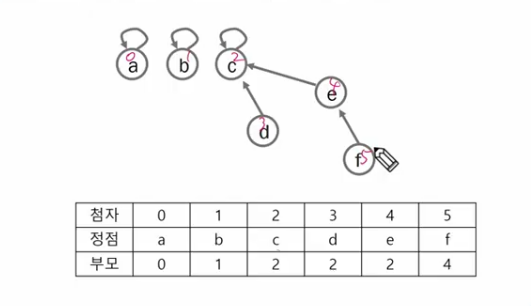

- 그래프 기본
- DFS
- BFS
- 서로소 집합들
- 최소 비용 신장 트리(MST)
- 최단 경로

## 학습목표

- 실 세계 문제를 그래프로 추상화해서 해결하는 방법 학습
    - 그래프 탐색 기법인 DFS와 BFS에 대해 학습
    - 그래프 알고리즘에 활용되는 상호 배타 집합(*Disjoint-Sets)*의 자료구조에 대해 학습
    - 최소 신장 트리를 이해하고 탐욕 기법을 이용해서 그래프의 최소 신장 트리 찾기
    - 그래프 두 정점 사이의 최단 경로(*Shortest Path)* 찾는 법 학습

## 그래프

- 그래프는 아이템들과 이들 사이의 연결 관계를 표현
- 그래프는 정점(*Vertex)* 들의 집합과 이들을 연결하는 간선(*Edge)*들의 집합으로 구성된 자료 구조
    - V : 정점의 개수
    - E : 그래프에 포함된 간선의 개수
    - V 개의 정점을 가지는 그래프는 최대 V(V-1)/2 간선이 가능
- 선형 자료구조나 트리 자료구조로 표현하기 어려운 N : N 관계를 가지는 원소들을 표현하기에 용이

## 그래프 유형

- 무향 그래프(*Undirected Graph)*
- 유향 그래프(*Directed Graph)*
- 가중치 그래프(*Weighted Graph)*
    - 간선에 가중치(비용)가 써져 있는 경우
- 사이클 없는 방향 그래프(*DAG)*
    - 사이클 : 방향을 따라가면 자기 자신으로 돌아오는 경우
    - *DAG, Directed Acyclic Graph* → 돌아오지 않는 경우
- 완전 그래프
    - 정점 들에 대해 가능한 모든 간선들을 가진 그래프
    - 간선의 개수가 최대인 경우
- 부분 그래프
    - 원래 그래프에서 일부의 정점이나 간선을 제외한 그래프

### 인접(*Adjacency*)

- 두 개의 정점에 간선이 존재(연결됨)하면 *“서로 인접해 있다”*
- 완전 그래프에 속한 임의의 두 정점들은 모두 인접해 있다

### 그래프 경로

- 경로란 간선들을 순서대로 나열한 것
    - 간선들 : (0, 2) (2, 4) (4, 6)
    - 정점들 : 0 - 2 - 4 - 6
- 경로 중 한 정점을 최대한 한 번만 지나는 경로를 *단순경로*라 한다
- 시작한 정점에서 끝나는 경로를 *사이클(Cycle)*이라 한다

### 그래프 표현

- 간선의 정보를 저장하는 방식, 메모리나 성능을 고려해서 결정
- 인접 행렬(*Adjacent matrix)*
    - V x V 크기의 2차원 배열을 이용해서 간선 정보 저장
    - 배열의 배열(포인터 배열)
- 인접 리스트(*Adjacent List)*
    - 각 정점마다 해당 정점으로 나가는 간선의 정보 저장
- 간선의 배열 → MST
    - 간선(시작 정점, 끝 정점)을 배열에 연속적으로 저장
    

### 인접 행렬

- 두 정점을 연결하는 간선의 유무를 행렬로 표현
    - 행 번호화 열 번호는 그래프 정점에 대응
    - 두 정점이 인접되어 있으면 1, 그렇지 않으면 0
    - 무향 그래프
        - *i번째 행의 합 = i번째 열의 합 = Vi의 차수*
        
        ```python
        a, b = map(int, input().split())
        A[a][b] = 1
        A[b][a] = 1
        ```
        
    - 유향 그래프
        - *행 i의 합 = Vi의 진출 차수 ⇒ 여기에서 나갈 수 있는(이동할 수 있는) 곳의 개수*
        - *열 i의 합 = Vi의 진입 차수 ⇒ 여기로 들어올 수 있는 곳의 개수*
        
        ```python
        A[a][b] = 1
        ```
        
    - 실생활 문제에서는 방향성 잘 따져야 → 친구 관계 : 방향성 X


- 인접 행렬의 단점?
    - 2차원 배열은 *1,000 X  1,000*까지만 만들자고 하면 빈 칸의 개수가 너무 많음
    

## DFS

- 그래프 순회(탐색)
    - 비선형구조인 그래프로 표현된 모든 자료(정점)을 빠짐없이 탐색하는 것을 의미
    - 깊이 우선 탐색(DFS)
    - 너비 우선 탐색(BFS)
- 시작 정점의 한 방향으로 갈 수 있는 경로가 있는 곳까지 깊이 탐색해 가다가 더 이상 갈 곳이 없게 되면, 가장 마지막에 만났던 갈림길 간선이 있는 정점으로 되돌아와서 다른 방향의 정점으로 탐색을 계속 반복하여 결국 모든 정점을 방문하는 순회방법
- 가장 마지막에 만났던 갈림길의 정점으로 되돌아가서 다시 깊이 우선 탐색을 반복해야 하므로 후입선출(LIFO) 구조의 스택 사용

### 스택

- 스택의 특성
    - 물건을 쌓아 올리듯 자료를 쌓아 올린 형태의 자료구조
    - 선형 구조 : 자료 간의 관계가 1대1 관계
        - *cf) 비선형 구조 : 자료 간의 관계가 1대 N의 관계를 갖는다(예 : 트리)*
    - 마지막에 삽입한 자료를 가장 먼저 꺼냄
        - 후입 선출(LIFO, *Last In FIrst Out)*

### DFS - 재귀

```python
DFS_Recursive(G, v)
	visitd[v] -> True
	for each all w in adjacency(G, v)
		if visit[w] != True
			DFS_Recursive(G, w)
```

### DFS - 반복

- 지나간 정점을 저장
- 현재 정점에서 갈 수 있는 갈림길들을 저장

```python
stack = s
visit = []
dfs(v)
	push (s, v)
	while not isEmpty(s)
		v = stack.pop()
		if not visit[v]
			visit(v)
			for each w in adjacency(v)
				if not visit[w]
					push(s, w)
```

## BFS

- 탐색 시작점의 인접한 정점들을 모두 차례로 방문한 후에, 방문했던 정점을 시작점으로 하여 다시 인접한 정점들을 차례로 방문하는 방식
- 인접한 정점들에 대해 탐색을 한 후, 차례로 다시 너비우선탐색을 진행해야 하므로, 선입선출(FIFO) 형태의 자료구조인 큐를 활용

```python
BFS(G, v)
	큐 생성
	시작점 v를 큐에 삽입
	점 v를 방문한 것으로 표시
	while 큐가 비어 있지 않은 경우
		t -> 큐의 첫번째 원소 반환
		For t와 연결된 모든 선에 대해
			u -> t의 이웃점
			u 가 방문되지 않은 곳이면
			u를 큐에 넣고, 방문한 것으로 표시
```

### [SWEA] 상원이의 생일파티(BFS)

```python
T = int(input())
for tc in range(1, T+1):
    N, M = map(int, input().split())
    arr = [[] for _ in range(N+1)]
    visit = [0] * (N+1)
    cnt = 0
 
    for _ in range(M):
        a, b = map(int, input().split())
        arr[a].append(b)
        arr[b].append(a)
 
    queue = [(1, 0)]
    while queue:
        s, c = queue.pop(0)
        visit[s] = 1
        if c >= 2:
            break
        for i in arr[s]:
            if visit[i] == 0:
                visit[i] = 1
                cnt += 1
                queue.append((i, c+1))
 
    print(f'#{tc}', cnt)
```

## 서로소 집합들

- 서로소 또는 상호배타 집합들은 서로 중복 포함된 원소가 없는 집합들
- 교집합이 없음
- 집합에 속한 하나의 특정 멤버를 통해 각 집합들을 구분한다 → 구분자(*representative)*

- 상호배타 집합을 표현하는 방법
    - 연결 리스트
    - 트리
- 상호배타 집합 연산
    - *Make-set(x)*
    - *Find-set(x) : y가 속해 있는 집합의 대표 원소 출력*
    - *Union(x, y) : x가 대표인 집합과 y가 대표인 집합 합치기*

### 상호 배타 집합 표현 - 트리

- 하나의 집합을 하나의 트리로 표현
- 자식 노드가 부모 노드를 가리키며 루트 노드가 대표자가 됨
- *Union(d, f)*
    - d의 대표 원소 찾기(d → c)
    - f의 대표 원소 찾기(f → e)
    - f의 대표원소를 d의 대표원소로 교체(f → e / f → e → c)
    
    
    
- *Make-set*

```python
def makeSet(v):
		tree[v] = v
```

- *find-set*

```python
def findSet(v):
	while tree[v] != v:
		v = tree[v]
	return v
```

- *Union(x, y)*

```python
def union(x, y):
	tree[findSet(y)] = findSet(x)
```

- 연산의 효율을 높이는 방법
    - *Rank*를 이용한 *Union*

## 최소 신장 트리(MST)

- 신장 트리(*Spanning Tree)*
    - 그래프 내의 모든 정점을 포함하는 트리
    - 그래프에서 일부 간선을 선택해서 만든 트리
    - 그래프의 **최소 연결 부분 그래프**
        - 최소 연결 == 간선의 수가 가장 적음
        - 예시) n개의 정점을 가지는 그래프의 최소 간선의 수는 (n-1)개이고, 
        (n-1)개의 간선으로 연결되어 있으면 필연적으로 트리 형태가 되고 이것이 바로 Spanning Tree가 됨
- 최소 신장 트리 (*Minimum Spanning Tree)*
    - 무방향 가중치 그래프에서 신장 트리를 구성하는 간선들의 가중치의 합이 최소인 신장 트리
    - 그래프에서 모든 노드를 포함하면서 사이클이 존재하지 않음 → 트리
- 그래프에서 최소 비용 문제
    - 모든 정점을 연결하는 간선들의 가중치의 합이 최소
    - 두 정점 사이의 최소 비용 경로 찾기

- 수도 코드 → 파이썬 코드

```python
def MST_PRIM(G, s): # G: 그래프, s: 시작점
    key = [INF] * N # 가중치를 무한대로 초기화 (최대값으로 설정)
    pi = [None] * N # 트리에서 연결될 부모 정점 초기화
    visited = [False] * N # 방문 여부 초기화
    key[s] = 0 # 시작 정점의 가중치를 0 으로 설정

    for _ in range(N):
        minIndex = -1
        min = INF
        for i in range(N):
            # 방문 안한 정점중 최소 가중치 정점 찾기
            if not visited[i] and key[i] < min:
                min = key[i]
                minIndex = i
        visited[minIndex] = True # 최소 가중치 정점 방문 처리

        for v, val in G[minIndex]: # 선택 정점의 인접한 정점
            if not visited[v] and val < key[v]:
                key[v] = val       # 가중치 갱신
                pi[v] = minIndex   # 트리에서 연결될 부모 정점
```

```python
V, E = map(int, input().split())
adjM = [[0] * (V+1) for _ in range(V+1)]
adjL = [[] for _ in range(V+1)]
for _ in range(E):
    u, v, w = map(int, input().split())
		# 인접 행렬
    adjM[u][v] = w
    adjM[v][u] = w
		# 인접 리스트
    adjL[u].append((v, w))
    adjL[v].append((u, w))
```

## Prim 알고리즘

- 하나의 정점에서 연결된 간선들 중 하나씩 선택하면서 MST를 만들어 가는 방식
    - 임의의 정점을 하나 선택해서 시작
    - 선택한 정점과 인접하는 정점들 중의 최소 비용의 간선이 존재하는 정점 선택
    - 모든 정점이 선택될 때까지 1), 2) 과정 반복
- 서로소인 2개의 집합 정보 유지
    - 트리 정점들 - MST를 만들기 위해 선택된 정점들
    - 비트리 정점들 - 선택 되지 않은 정점들

- prim 알고리즘 구현 코드

```python
def prim(r, V):
    MST = [0] * (V+1)       # MST 포함여부
    key = [10000] * (V+1)   # 가중치의 최대값 이상으로 초기화
    key[r] = 0              #시작 정점의 key(비용)
    for _ in range(V):      # V개의 정점 돌며 MST 추가
        u = 0
        minV = 10000
        for i in range(V+1):
            # MST에 포함되지 않은 정점 중 key가 최소인 u찾기
            if MST[i] == 0 and key[i] < minV:
                u = i
                minV = key[i] 
        MST[u] = 1
				# u에 인접인 정점 v에 대해, MST에 포함되지 않은 정점이면
        for v in range(V+1):
            if MST[v] == 0 and adjM[u][v] > 0: # 아직 MST에 포함되지 않고, u와 연결된 정점
                key[v] = min(key[v], adjM[u][v]) # u를 통해 MST에 포함되는 비용과 기존값

    return sum(key) # MST 가중치의 합

V, E = map(int, input().split())
adjM = [[0] * (V+1) for _ in range(V+1)]
adjL = [[] for _ in range(V+1)]
for _ in range(E):
    u, v, w = map(int, input().split())
    adjM[u][v] = w
    adjM[v][u] = w
    adjL[u].append((v, w))
    adjL[v].append((u, w))

print(prim())
```

```python
def prim(r, V):
    MST = [0] * (V+1)   # MST 생성
    MST[r] = 1          # 시작정점 표시
    s = 0               # MST 간선의 가중치 합
    for _ in range(V):
        u = 0 
        minV = 1000
        for i in range(V+1):
            if MST[i] == 1:
                for j in range(V+1):
                    if adjM[i][j] > 0 and MST[j] == 0 and minV > adjM[i][j]:
                        u = j
                        minV = adjM[i][j]
        s += minV
        MST[u] = 1
    return s

V, E = map(int, input().split())
adjM = [[0] * (V+1) for _ in range(V+1)]
adjL = [[] for _ in range(V+1)]
for _ in range(E):
    u, v, w = map(int, input().split())
    adjM[u][v] = w
    adjM[v][u] = w
    adjL[u].append((v, w))
    adjL[v].append((u, w))

print(prim())
```

## KRUSKAL 알고리즘

- 간선을 하나씩 선택해서 MST를 찾는 알고리즘
    - 최초, 모든 간선을 가중치에 따라 오름차순 정렬
    - 가중치가 낮은 간선부터 선택하면서 트리 증가
    - n-1 개의 간선이 선택될 때까지 반복

```python
def find_set(x):
    while x != rep[x]:
        x = rep[x]
    return x

def union(x, y):
    rep[find_set[y]] = find_set(x)

V, E = map(int, input().split())
edge = []
for _ in range(E):
    u, v, w = map(int, input().split())
    edge.append([u, v, w])
edge.sort(key = lambda x:x[2])
rep = [i for i in range(V+1)]

N = V+1
cnt = 0 # 선택한 edge의 수
total = 0
for u, v, w in edge:
    if find_set(u) != find_set(v):
        cnt += 1
        union(u, v)
        total += w
        if cnt == N-1:
            break
print(total)
```

## 최단 경로

- 간선의 가중치가 있는 그래프에서 두 정점 사이의 경로들 중에 간선의 가중치의 합이 최소인 경로
- 하나의 시작 정점에서 끝 정점까지의 최단경로
    - 다익스트라 알고리즘 : 음의 가중치 허용 X
    - 벨만 포드 알고리즘 : 음의 가중치 허용
- 모든 정점들에 대한 최단 경로
    - 플로이드-워샬 알고리즘

## 다익스트라 알고리즘

- 시작 정점에서 거리가 최소인 정점을 선택해 나가면서 최단 경로 구하기
- 시작 정점(s)에서 끝 정점(t) 까지의 최단 경로에 정점 x가 존재
- 최단 경로는 s에서 x까지의 최단 경로와 x에서 t까지의 최단 경로로 구성

- 인수의 생일 파티

```python
"""
1
4 8 2
1 2 4
1 3 2
1 4 7
2 1 1
2 3 5
3 1 2
3 4 4
4 2 3
"""
def dijkstra(N, X, adj, d):
    for i in range(N+1):
        d[i] = adj[X][i]
    U = [X]
    for _ in range(N+1):    # N개의 정점 중 출발을 제외한 정점 선택
        w = 0
        for i in range(1, N+1):
            if i not in U and d[i] < d[w]: # 남은 노드 중 비용이 최소인 w
                w = i
        U.append(w)
        for v in range(1, N+1): # 정점 i가 w에 인접이면
            if 0 < adj[w][v] < 1000000: 
                d[v] = min(d[v], d[w] + adj[w][v])

T = int(input())
for tc in range(1, T+1):
    N, M, X = map(int, input().split())
    arr = [[1000000] * (N+1) for _ in range(N+1)] # 돌아가는 배열

    for i in range(N+1):
        arr[i][i] = 0

    for _ in range(M):
        x, y, c = map(int, input().split())
        arr[x][y] = c
    
    # 인수의 집에서 다른 집으로 가는 비용
    dOut = [0] * (N+1)

    dijkstra(N, X, arr, dOut)
    print(dOut)
    print(f'#{tc}')
```
