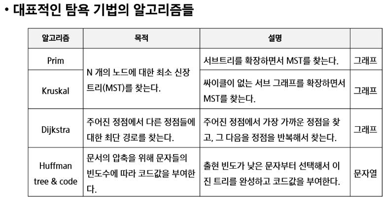

## 목차

- [반복(*Iteration*)과 재귀(*Recursion*)](https://github.com/SuhyungK/TIL/blob/master/3_Algorithm/12_%EC%99%84%EC%A0%84%ED%83%90%EC%83%89_%EA%B7%B8%EB%A6%AC%EB%94%94.md#%EB%B0%98%EB%B3%B5%EA%B3%BC-%EC%9E%AC%EA%B7%80)
- [완전 검색 기법](https://github.com/SuhyungK/TIL/blob/master/3_Algorithm/12_%EC%99%84%EC%A0%84%ED%83%90%EC%83%89_%EA%B7%B8%EB%A6%AC%EB%94%94.md#%EB%B0%98%EB%B3%B5%EA%B3%BC-%EC%9E%AC%EA%B7%80)
- [순열](https://github.com/SuhyungK/TIL/blob/master/3_Algorithm/12_%EC%99%84%EC%A0%84%ED%83%90%EC%83%89_%EA%B7%B8%EB%A6%AC%EB%94%94.md#%EB%B0%98%EB%B3%B5%EA%B3%BC-%EC%9E%AC%EA%B7%80)
- [부분 집합](https://github.com/SuhyungK/TIL/blob/master/3_Algorithm/12_%EC%99%84%EC%A0%84%ED%83%90%EC%83%89_%EA%B7%B8%EB%A6%AC%EB%94%94.md#%EB%B0%98%EB%B3%B5%EA%B3%BC-%EC%9E%AC%EA%B7%80)
- [조합](https://github.com/SuhyungK/TIL/blob/master/3_Algorithm/12_%EC%99%84%EC%A0%84%ED%83%90%EC%83%89_%EA%B7%B8%EB%A6%AC%EB%94%94.md#%EB%B0%98%EB%B3%B5%EA%B3%BC-%EC%9E%AC%EA%B7%80)
- [탐욕 알고리즘](https://github.com/SuhyungK/TIL/blob/master/3_Algorithm/12_%EC%99%84%EC%A0%84%ED%83%90%EC%83%89_%EA%B7%B8%EB%A6%AC%EB%94%94.md#%EB%B0%98%EB%B3%B5%EA%B3%BC-%EC%9E%AC%EA%B7%80)
  
## 학습목표

- 재귀적 알고리즘의 특성을 이해하고 이를 구현하기 위한 재귀 호출에 대해 학습한다
- 완전 검색의 개념을 이해하고 완전 검색을 통한 문제 해결 방법에 대해 학습
- 조합적 문제에 대한 완전 검색 방법에 대해 이해
    - 순열, 조합, 부분집합 생성 알고리즘에 대한 이해
- 탐욕 알고리즘 기법의 개념과 주요 특성을 이해

## 반복과 재귀

- 반복과 재귀는 유사한 작업 수행
- 반복은 수행하는 작업이 완료될 때 까지 계속 반복
- 재귀는 주어진 문제의 해를 구하기 위해 동일하면서 더 작은 문제의 해를 이용하는 방법

### 반복을 이용한 선택정렬

```python
def SelectionSort(A):
	n = len(A)
	for i in range(0, n-1):
		minI = i
		for j in range(i+1, n):
			if A[j] < A[minI]:
				minI = j
		A[minI], A[i] = A[i], A[minI]
```

### 재귀 함수 (*recursive function)*

- 함수 내부에서 직접 or 간접으로 자기 자신을 호출하는 함수
    - 자기 자신을 호출하는 (X)
    - 똑같이 생긴 다른 함수를 호출하는 ( O )
- 기본 부분(*basis part)*와 유도 부분(*inductive part)*로 구성

```python
def fact(n):
	if n <= 1:
		return 1            # Basis part
	else:
		return n* fact(n-1) # Inductive part 
```

### [학습 Tip]

- 새로운 문제보다 복습을 → 이해도 ↑
- 빠르고 정확하게 푸는 연습이 됨

## 고지식한 방법(brute-force)

- 문제를 해결하는 간단하고 쉬운 접근법
- *force :* 사람보다는 컴퓨터의 *force* 의미
- 상대적으로 빠른 시간 안에 알고리즘 설계를 할 수 있음
- 문제에 포함된 자료의 크기가 작다면 유용
- 학술적 or 교육적 목적을 위해 알고리즘의 효율성을 판단하기 위한 척도로 사용됨

```python
# 리스트에서 키 값을 찾기 위해 첫 번째 자료부터 비교하면서 진행
def sequentialSearch(arr, k):
	i = 0
	while i < n and arr[i] != k:
		i += 1
	if i < n : return i
	else : return -1

# arr[n] = k를 추가하면 i < n(인덱스 길이 조건문) 필요 없음
def sequentialSearch(arr, k):
	arr[n] = k
	i = 0
	while arr[i] != k:
		i += 1
	if i < n : return i
	else : return -1
```

- 모든 경우의 수를 테스트하기 때문에 수행 속도는 느리지만, 해답을 찾아내지 못할 확률이 적음
- 이를 기반으로 그리디 기법이나 동적 계획법을 이용해서 효율적 알고리즘 찾을 수 있음
- 우선 완전 검색으로 접근하여 해답을 도출한 후 → 성능 개선을 위해 다른 알고리즘을 사용

## 완전 검색

- 많은 종류의 문제들이 특정 조건을 만족하는 경우나 요소 찾는 것
- 전형적으로 순열, 조합, 부분 집합과 같은 조합적 문제들과 연관된다
- 완전 검색은 조합적 문제에 대한 *brute- force* 방식

## 순열

### 여행사 B.I.G sale!

- 어느 경로로 여행할까
- 최대 개수의 도시를 선택하려면?
- 3곳을 선택하여 여행 → 어느 도시를 선택할 때 가장 이득일까?

### 순열

- 서로 다른 것들 중 몇 개를 뽑아서 한 줄로 나열하는 것
- 서로 다른 n개 중 r개를 택하는 순열은 아래와 같이 표현
- $nPr$  = $n * (n-1) * (n-2) * … * (n-r+1)$ ⇒ 전체 *r*번
- = $n!/(n-r)!$
- $nPn$ = $n! = n * (n-1) * (n-2) * …* 2 * 1$다

- 다수의 알고리즘 문제들은 순서화 된 요소들의 집합에서 최선의 방법을 찾는 것과 관련 있음
    - *TSP(Traveling Salesman Problem)*

### 단순하게 순열 생성하는 방법

- {1, 2, 3} 을 포함하는 모든 순열 생성하는 함수
    - 동일한 숫자가 포함되지 않았을 때, 각 자리 수 별로 반복문 이용

```python
arr = [1, 2, 3]
for i1 in range(3):
	for i2 in range(3):
		if i1 != i2:    # 같은 경우는 이미 순열에 있는 숫자이기 때문에 사용하지 X
			for i3 in range(3):
				if i3 != i1 and i3 != i2:    # 기존에 순열에 있는 숫자는 안되기 때문 X
					print(arr[i1], arr[i2], arr[i3])
"""
1 2 3
1 3 2
2 1 3
2 3 1
3 1 2
3 2 1
"""
```

- 사전 적 순서
    - 크기 별로 나오는 경우

- 최소 변경을 통한 방법
    - [1 2 3], [3 2 1], [2 3 1], [2 1 3], [3 1 2], [1 3 2]
    
- 순열 기본 → 자리이동

```python
def f(i, k):
	if i == k:
		print(p)
	else:
		for j in range(i, k):
			p[i], p[j] = p[j], p[i]
			f(i+1, k)
			p[i], p[j] = p[j], p[i]

p = [1, 2, 3, 4]
f(0, 4)

"""
[1, 2, 3, 4]
[1, 2, 4, 3]
[1, 3, 2, 4]
[1, 3, 4, 2]
[1, 4, 3, 2]
[1, 4, 2, 3]
[2, 1, 3, 4]
[2, 1, 4, 3]
[2, 3, 1, 4]
[2, 3, 4, 1]
[2, 4, 3, 1]
[2, 4, 1, 3]
[3, 2, 1, 4]
[3, 2, 4, 1]
[3, 1, 2, 4]
[3, 1, 4, 2]
[3, 4, 1, 2]
[3, 4, 2, 1]
[4, 2, 3, 1]
[4, 2, 1, 3]
[4, 3, 2, 1]
[4, 3, 1, 2]
[4, 1, 3, 2]
[4, 1, 2, 3]
"""
```

- 순열 기본 → *used* 사용

```python
def f(i, k):
	if i == k:
		print(p)
	else:
		for j in range(k):
			if used[j] == 0: # a[j]가 아직 사용되지 않았으면
				used[j] = 1	 # a[j] 사용됨으로 표시
				p[i] = a[j]  # p[i] = a[j] 로 결정
				f(i+1, k)  	 # p[i+1] 값을 결정하러 이동
				used[j] = 0  # a[j] 를 다른 자리에서 쓸 수 있도록 해제

N = 3
a = [i for i in range(1, N+1)]
used = [0] * N
p = [0] * N
f(0, N)

"""
[1, 2, 3]
[1, 3, 2]
[2, 1, 3]
[2, 3, 1]
[3, 1, 2]
[3, 2, 1]
"""
```

- N 개 중에서 r 개를 고르는 순열

```python
def f(i, k, r): # N개 중에서 r 개만 고르고 싶을 때
	if i == r:
		print(p)
	else:
		for j in range(k):
			if used[j] == 0: # a[j]가 아직 사용되지 않았으면
				used[j] = 1	 # a[j] 사용됨으로 표시
				p[i] = a[j]  # p[i] = a[j] 로 결정
				f(i+1, k, r)  	 # p[i+1] 값을 결정하러 이동
				used[j] = 0  # a[j] 를 다른 자리에서 쓸 수 있도록 해제

N = 5
R = 3
a = [i for i in range(1, N+1)]
used = [0] * N
p = [0] * R
f(0, N, R)
```

- 특정 숫자로 시작하는 순열

```python
def f(i, k): 
	if i == k:
		print(p)
	else:
		for j in range(k):
			if used[j] == 0: # a[j]가 아직 사용되지 않았으면
				used[j] = 1	 # a[j] 사용됨으로 표시
				p[i] = a[j]  # p[i] = a[j] 로 결정
				f(i+1, k)  	 # p[i+1] 값을 결정하러 이동
				used[j] = 0  # a[j] 를 다른 자리에서 쓸 수 있도록 해제

N = 5
a = [i for i in range(1, N+1)]
used = [0] * N
p = [0] * N
p[0] = 1
used[0] = 1
f(1, N)
"""
[1, 2, 3, 4, 5]
[1, 2, 3, 5, 4]
[1, 2, 4, 3, 5]
[1, 2, 4, 5, 3]
[1, 2, 5, 3, 4]
[1, 2, 5, 4, 3]
[1, 3, 2, 4, 5]
[1, 3, 2, 5, 4]
[1, 3, 4, 2, 5]
[1, 3, 4, 5, 2]
[1, 3, 5, 2, 4]
[1, 3, 5, 4, 2]
[1, 4, 2, 3, 5]
[1, 4, 2, 5, 3]
[1, 4, 3, 2, 5]
[1, 4, 3, 5, 2]
[1, 4, 5, 2, 3]
[1, 4, 5, 3, 2]
[1, 5, 2, 3, 4]
[1, 5, 2, 4, 3]
[1, 5, 3, 2, 4]
[1, 5, 3, 4, 2]
[1, 5, 4, 2, 3]
[1, 5, 4, 3, 2]

Process finished with exit code 0
"""
```

- *baby-jin* 완전 탐색 방식

```python
def f(i, k):
	if i == k:
		print(p)
	else:
		for j in range(k):
			if used[j] == 0: # a[j]가 아직 사용되지 않았으면
				used[j] = 1	 # a[j] 사용됨으로 표시
				p[i] = a[j]  # p[i] = a[j] 로 결정
				f(i+1, k)  	 # p[i+1] 값을 결정하러 이동
				used[j] = 0  # a[j] 를 다른 자리에서 쓸 수 있도록 해제

a = [1, 2, 4, 7, 8, 3]
used = [0] * 6
p = [0] * 6
f(0, 6)

"""
[1, 2, 4, 7, 8, 3]
[1, 2, 4, 7, 3, 8]
[1, 2, 4, 8, 7, 3]
[1, 2, 4, 8, 3, 7]
[1, 2, 4, 3, 7, 8]
[1, 2, 4, 3, 8, 7]
[1, 2, 7, 4, 8, 3]
[1, 2, 7, 4, 3, 8]
[1, 2, 7, 8, 4, 3]
[1, 2, 7, 8, 3, 4]
[1, 2, 7, 3, 4, 8]
[1, 2, 7, 3, 8, 4]
...
...
"""
```

### [SWEA] 4881 배열 최소의 합

```python
def f(i, k):
	global minV
	if i == k:
		# s = sum([arr[l][p[l]] for l in range(k)])
		# if minV > s:
		# 	minV = s
		print(p)

	else:
		for j in range(i, k):
			p[i], p[j] = p[j], p[i]
			f(i+1, k)
			p[i], p[j] = p[j], p[i]

T = int(input())
for tc in range(1, T+1):
	N = int(input())
	# arr = [list(map(int, input().split())) for _ in range(N)]
	p = [i for i in range(N)]
	minV = N ** 10

	f(0, N)
	print(f'#{tc}', minV)
```

```python
def f(i, k, s):
	global minV
	if i == k:
		if s < minV:
			minV = s

	if s > minV:
		return

	for j in range(N):
		if visit[j] == 0:
			visit[j] = 1
			f(i+1, k, s+arr[i][j])
			visit[j] = 0

T = int(input())
for tc in range(1, T+1):
	N = int(input())
	arr = [list(map(int, input().split())) for _ in range(N)]
	visit = [0] * N
	minV = N ** N

	f(0, N, 0)
	print(f'#{tc}', minV)
```

## 부분 집합

- 집합에 포함된 원소들을 선택하는 것
- 원소들의 그룹에서 최적의 부분 집합을 찾는 것
- N개의 원소를 포함한 집합
    - 자기 자신과 공집합 포함한 모든 집합(*power set)*의 개수는 $2^n$ 개
    - 원소의 수가 증가하면 부분집합의 개수는 지수적으로 증가

### 바이너리 카운팅을 통한 사전적 순서

- 원소 수에 해당하는 N개의 비트열 이용
- n번째 비트값이 1이면 n번째 원소가 포함되었음을 의미
- 0 ~ $2^n -1$ ⇒ $1<<n -1$

```python
# 모든 부분집합을 다 생성해야 할 때

arr = [3, 6, 7, 1, 5, 4]
n = len(arr)

for i in range(1<<n):
	for j in range(n):
		if i & (1<<j):	# j 번 비트가 0이 아니면 arr[j] 가 부분집합의 원소가 됨
			print(arr[j], end=' ')
	print()

"""
3 
6
3 6
7
3 7
6 7
3 6 7
"""
```

- *bit 방식*

```python
def f(i, k):
    if i == k:
        # print(bit)
        for j in range(k):
            if bit[j]:
                print(arr[j], end=' ')
        print()
    else:
        bit[i] = 0
        f(i+1, k)
        bit[i] = 1
        f(i+1, k)

arr = [3, 6, 7, 1, 5, 4]
n = len(arr)

bit = [0] * n
f(0, n)

"""

4 
5 
5 4 
1 
1 4 
1 5 
1 5 4 
7 
7 4 
7 5 
7 5 4 
7 1 
7 1 4 
7 1 5 
7 1 5 4 
6 
6 4 
6 5 
6 5 4 
6 1 
6 1 4 
6 1 5 
6 1 5 4 
6 7 
6 7 4 
6 7 5 
6 7 5 4 
6 7 1 
6 7 1 4 
6 7 1 5 
6 7 1 5 4 
3 
3 4 
3 5 
3 5 4 
3 1 
3 1 4 
3 1 5 
3 1 5 4 
3 7 
3 7 4 
3 7 5 
3 7 5 4 
3 7 1 
3 7 1 4 
3 7 1 5 
3 7 1 5 4 
3 6 
3 6 4 
3 6 5 
3 6 5 4 
3 6 1 
3 6 1 4 
3 6 1 5 
3 6 1 5 4 
3 6 7 
3 6 7 4 
3 6 7 5 
3 6 7 5 4 
3 6 7 1 
3 6 7 1 4 
3 6 7 1 5 
3 6 7 1 5 4 

Process finished with exit code 0
"""
```

## 조합

- 서로 다른 n개의 원소 중 r개를 순서 없이 골라낸 것을 조합(*combination)*이라고 부름
- $nCr = n! / (n-r)!r!$
- $nCr = n-1Cr-1 + n-1Cr$
    - r이 반드시 포함될 때 n-1(r을 제외한)개 중에 r-1 고르는 경우
    - r이 반드시 포함되지 않을 때, n-1개 중에 r개를 고르는 경우
- $nC0=1$ : 아무것도 고르지 않는 1가지 경우

- 범위 내에 3가지 조합 구하기

```python
N = 10
for i in range(N-2):
    for j in range(i+1, N-1):
        for k in range(j+1, N):
            print(i, j, k)

"""
0 1 2
0 1 3
0 1 4
0 1 5
0 1 6
0 1 7
0 1 8
0 1 9
0 2 3
0 2 4
0 2 5
0 2 6
0 2 7
0 2 8
...
...
"""
```

- 재귀를 이용한 조합

```python
def nCr(n, r, s):
    if r == 0:
        print(*comb)
    else:
        for i in range(s, n-r+1):
            comb[r-1] = A[i]
            nCr(n, r-1, i+1)
            
A = [1, 2, 3, 4, 5]
n = len(A)
r = 3
comb = [0] * r
nCr(n, r, 0)
```

### 연습문제3 - 부분집합의 합 문제 구현하기

- 10개 정수 집합에 대한 모든 부분 집합 중 원소의 합이 0이 되는 부분집합을 모두 출력

## 탐욕 알고리즘

- 손님이 지불한 금액에서 물건값을 제한 거스름돈 지불하는 문제
- 어떻게 하면 손님에게 거스름돈으로 주는 지폐와 동전의 개수를 최소한으로…?
- 최적해를 구하는 데 사용되는 근시안적인 방법



### 대표적인 탐욕 기법 알고리즘들

- *Prim*
- *Kruskal*
- *Dijkstra*(다익스트라) → 주어진 정점에서 가장 가까운 정점을 찾고 또 거기서 가까운 정점 찾고…
- *Huffman Tree & code*
- 배낭 짐싸기
- 회의실 배정하기
  - 가능한 많은 회의가 열리기 위해서 회의들을 어떻게 배정해야 할까?
      - 회의 개수 1
      - (시작시간, 종료시간) 1 4 1 6 6 10 5 7 5 9 …