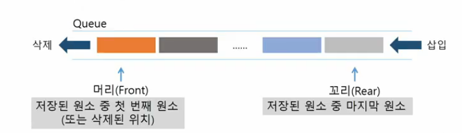
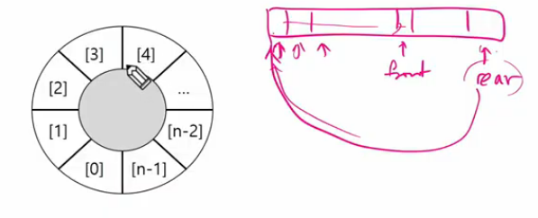
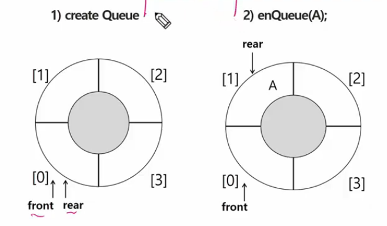
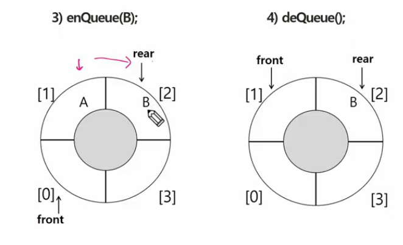

# 큐

- 선형큐
- 원형큐
- 우선순위 큐
- 큐의 활용 : 버퍼
- BFS
- BFS 예제

## 큐(Queue)의 특성

- 스택과 마찬가지로 삽입과 삭제의 위치가 제한적인 자료구조
- 큐의 뒤에서는 삽입만 하고, 큐의 앞에서는 삭제만 이루어지는 구조
- 선형 자료 구조형
- 선입선출구조(`FIFO` : First In First Out)
    - 큐에 삽입한 순서대로 원소가 저장되어, 가장 먼저 삽입된 원소는 가장 먼저 삭제
    

## 큐의 선입 선출 구조


- 꺼내지는 위치와 삽입되는 위치가 따로 관리

## 큐의 연산

### 큐의 기본 연산

- 삽입 :  `enQueue`
- 삭제 : `deQueue`
    - 스택에서 사용하는 `push, pop` 과는 구분해서 사용할 것

### 주요 연산

`enQueue(item)` : 큐의 뒤쪽(`rear` 다음)에 원소를 삽입하는 연산

- `deQueue` : 큐의 앞쪽에 원소를 삭제하고 반환하는 연산
- `createQueue` : 공백 상태의 큐를 생성하는 연산
- `isEmpty()` : 큐가 공백상태인지를 확인하는 연산
- `isFull()` : 큐가 포화상태인지를 확인하는 연산
- `Qpeek()` : 큐의 앞쪽 있는 원소가 무엇인지를 확인하는 연산(삭제없이 반환만)

### 큐의 연산 과정

- 공백 큐 생성

```python
Q = []
Q = [0] * 10

# front, rear 값 초기화
# 0 으로 하는 경우도 있지만 여기서는 -1
front = rear = -1
```

- 원소 A 삽입 `enQueue(A)`

```python
rear += 1 # front = -1
Q[rear] = A
```

```python
N = 3
q = [0] * N
front = rear = -1

rear += 1
# rear = (rear + 1) % len(q) : 원형 큐(순환 큐)
q[rear] = 10

rear += 1
q[rear] = 20

rear += 1
q[rear] = 30

# IndexError: list assignment index out of range
rear += 1
q[rear] = 40

"""
원형 큐는 한 자리 비워놓고 시작하기 때문에
q = [30, 10, 20] 
이런식으로 채워지다가
q = [30, 40, 20]
이렇게 덮어씌워짐
"""
```

- 원소 반환/ 삭제 `deQueue()`

```python
front += 1
# front : 마지막으로 꺼낸 자리
# rear : 마지막으로 저장된 위치
```

```python

# 인덱스를 옮기기만 해서 실제 값이 지워지는 건 아니지만
# 따로 사용되지 않기 때문에 무시당하는 것
front += 1
# front = (front + 1) % len(q) : 원형 큐
print(q[front])

front += 1
print(q[front])

front += 1
print(q[front])

"""
10
20
30
# 선입선출 구조
"""
```

```python
# append, pop 사용보다 빠름
from collections import deque

q = deque()

q.append(10)
q.append(20)
q.append(30)

print(q.popleft())
print(q.popleft())
print(q.popleft())
```

- `front` == `rear` : 큐가 비어있는 상태
    - 마지막으로 들어온 `item`이 꺼내진 상태

## 선형큐

- 1차원 배열을 이용한 큐(`List`로 구현)
    - 큐의 크기 = 배열의 크기
    - `front` : 저장된 첫 번째 원소의 인덱스
    - `rear` : 저장된 마지막 원소의 인덱스

- 상태표현
    - 초기 상태 : `front` = `rear` = -1
    - 공백 상태 : `front` == `rear`
    - 포화 상태 : `rear` == `n-1` (배열의 마지막 인덱스와 마지막으로 삽입된 원소의 위치가 동일)
    

### 큐의 구현

```python
queue = [0] * 10
front = rear = -1
```

### 삽입

- 마지막 원소 뒤에 새로운 원소 삽입하기 위해서
    - `rear` 값 하나 증가 시켜 새로운 원소를 삽입할 자리를 마련
    - 그 인덱스에 해당하는 배열에 원소를 저장

```python
def enQueue(item):
	global rear
	if isFull() : print("Queue_Full") # 디버깅용
	else:
		rear += 1
		Q[rear] = item
```

### 삭제 : deQueue()

- 가장 앞에 있는 원소를 삭제하기 위해
    - `front` 값을 하나 증가 시켜 큐에 남아있게 될 첫 번째 원소 이동
    - `front`현재 위치는 마지막으로 원소가 꺼내진 자리

```python
def deQueue()
	global front # 값을 가져다 읽기만 하는 게 아니라 변경하기 때문에
	if isEmpty() : print('Queue_Empty') # front = rear인 경우
	else:
		front += 1
		return Q[front]

# append, pop은 느림
```

### 공백 상태 및 포화 상태 검사 : isEmpty(), isFull()

- 공백 상태 : `front` == `rear`
- 포화 상태 : `rear` == `n-1`

```python
def isEmpty() : return fromt == rear
def Full() : return rear == len(Q) - 1
```

### 검색 : Qpeek()

- 가장 앞에 있는 원소 검색하여 반환하는 연산
- 현재 `front`의 한 자리 뒤에 있는 원소, 즉 큐의 첫 번째에 있는 원소를 반환
- 이 앞에 있는 값이 뭔지 확인하여 반환만 하는 거
- 근데 앞에 있는 게 항상 가장 앞에 있는 원소인가?

```python
def Qpeek():
	if isEmpty() : print('Queue_Empty')
	else : return Q[front+1]
```

## 선형 큐 이용시의 문제점

### 잘못된 포화 상태 인식

- `front` == `rear` 인 경우 `front`가 지나온 자리는 비어있는데도 불구하고 포화 상태로 인식하여 더 이상 삽입을 수행하지 않게 됨

### 해결 방법 1

- 매 연산이 이루어질 때마다 저장된 원소들을 배열의 앞부분으로 이동
- 매우 느려서 큐의 효율성이 급격히 떨어짐

### 해결 방법 2

- 1차원 배열을 사용하되, 논리적으로는 배열의 처음과 끝이 연결되어 원형 형태의 큐를 이룬다고 가정하고 사용



- 실제로는 인덱스를 처음으로 이동 시키는 것이지만 논리적으로는 원형으로 이루어져 있다고 가정

## 원형 큐

### 원형 큐의 구조

- 초기 공백 상태 : `front` == `rear` == 0

### Index의 순환

- `front`와 `rear`의 위치가 배열의 마지막 인덱스를 가리킨 후, 그 다음에는 논리적 순환을 이루어 배열의 처음 인덱스인 0으로 이동해야 함
- 나머지 연산자 `mod`사용

### front 변수

- 공백 상태와 포화 상태 구분을 쉽게 하기 위해 front가 있는 자리는 사용하지 않고 항상 빈자리로

### 삽입 위치 및 삭제 위치

- `rear` = `(rear+1) mod n`
- `front` =  `(front+1) mod n`

## 원형 큐의 연산 과정



- `enQueue` : `rear` 1 증가





- `rear` 다음에 `front` 인 경우가 큐가 가득 찬 상태
- `rear` == `front` : 큐가 비어 있는 상태
    - `front` 가 삭제를 거듭해서 `rear`가 있는 곳까지 온 상태이므로

### 초기 공백 큐 생성

- 크기 n인 1차원 배열 생성
- `front` == `rear` == 0

### 공백 상태 및 포화 상태 검사

- 공백 상태 : `front` == `rear`
- 포화 상태 : 삽입한 `rear`의 다음 위치 == `front`

```python
def isEmpty() : return front == rear
def isFull() : return (rear+1) % len(cQ) == front
```

### 삽입

- `rear` 값 조정하여 새로운 원소 삽입한 자리 마련

```python
def enQueue(item):
	glboal rear
	if isFull() : print('가득 참')
	else:
		rear = (rear + 1) % len(cQ)
		cQ[rear] = item

# 원형 큐의 경우도 크기가 작은 경우에는 큐가 가득 찬 상태가 됨
```

- 원형 큐는 1시간마다 정보가 갱신 되거나 정보를 덮어써도 되는 경우,
- 과거의 데이터가 더 이상 필요 없는 경우 덮어써서 지우는 방식으로 자주 사용

### 삭제

```python
def deQueue():
	global front
	if is Empty() : # 큐가 비어있지 않다면 꺼내기
	else:
		front = (front + 1) % len(cQ)
		return cQ[front]
```

```python
def isEmpty():
	return front == rear

def isFull():
	return (rear+1) % len(cQ) == front 
# rear 한 칸 앞이 front 인 경우
```

## 우선 순위 큐

- 우선순위를 가진 항목들을 저장하는 큐
- FIFO 순서가 아니라 우선순위가 높은 순서대로 먼저 나가게 됨

### 적용 분야

- 시뮬레이션 시스템
- 네트워크 트래픽 제어
- 운영체제의 테스크 스케줄링?

### 우선 순위 큐의 구현

- 배열을 이용한 우선 순위 큐
- 리스트를 이용한 우선 순위 큐

## 배열을 이용한 우선순위 큐

- 원소 삽입하는 과정에서 우선순위 비교하여 적절한 위치에 삽입
- 가장 앞에 최고 우선순위의 원소가 위치
- 배열을 사용하므로, 삽입이나 삭제 연산이 일어날 때 원소의 재배치가 일어남
- 메모리 낭비가 심하다

## 큐의 활용

## 버퍼

- 데이터를 한 곳에서 다른 한 곳으로 전송하는 동안 일시적으로 그 데이터를 보관하는 메모리의 영역
- 원래의 순서를 유지하면서
- 버퍼링 : 버퍼를 활용하는 방식 또는 버퍼를 채우는 동작 의미
    - 채워둔 최소한의 데이터 영역도 바닥났을 때

### 버퍼의 자료 구조

- 일반적으로 입출력 및 네트워크와 관련된 기능에서 이용
- 순서대로 입력출력전달되어야 하므로 선입 선출 방식의 자료구조인 큐가 활용

```python
p = 1 # 처음 줄 설 사람 번호

q = []
N = 20 # 초기 마이쮸 개수
m = 0 # 나눠준 개수
v = 0

# n번째 받아갈 때마다 n개씩 받아감
while m < N:
    q.append((p, 1, 0)) # 처음 줄 서는 사람 (전에 받아간 사람 뒤에 서는 것), 몇 번째로 받아가는지에 대한 정보
    v, c, my = q.pop(0)
    print(f'큐에 있는 사람 수 {len(q)+1}, 받아갈 사탕 수 {c}, 나눠준 사탕 수{m}')
    m += c
    q.append((v, c+1, my+c)) # 마이쮸를 받고 다시 서는 사람
                             # my : 원래 가지고 있던 마이쮸 / c : c번째 서면 c개 받음
    p += 1                   # 처음 줄서는 사람 번호
```

## Queue

### 기본 개념

- 뒤에서는 삽입, 앞에서는 삭제만 하는 자료구조
- 스택과의 가장 큰 차이는 **FIFO**
    - `Stack` ⇒ `top`
    - `Queue` ⇒ `front` & `rear`
- `Queue`도 `List`로 구현
    - `append` & `pop`
- 주의할 점은 `pop(0)`

### 기본 연산 과정

- 공백 큐 만들기
    - `front` & `rear` == `-1`
- 원소의 삽입 과정 ⇒ **rear의 증가**

### 선형 큐 구현시 주의 할 점

- 초기 상태 ⇒ `front` == `rear` == `-1`
- 공백 상태 ⇒ `front` == `rear`
- 포화 상태 ⇒ `rear` = n - 1