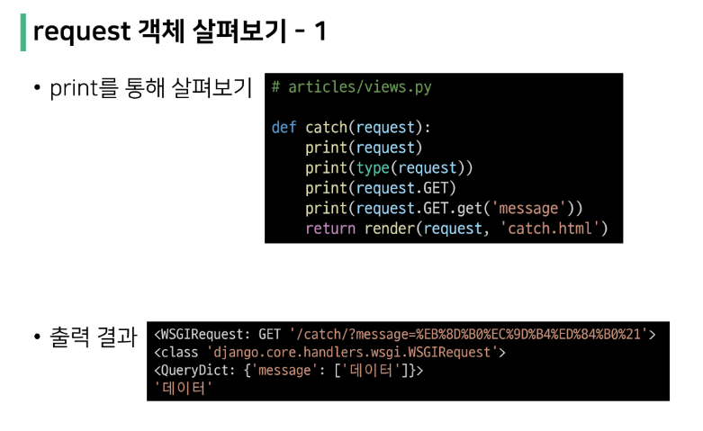

## Django

- [Django Intro](https://github.com/SuhyungK/TIL/blob/master/4_Django/01_View_Template.md#framework)
- [Django 구조 이해하기 (MTV Design Pattern)](https://github.com/SuhyungK/TIL/blob/master/4_Django/01_View_Template.md#django-%EA%B5%AC%EC%A1%B0-%EC%9D%B4%ED%95%B4%ED%95%98%EA%B8%B0)
- [Django Quick Start](https://www.notion.so/18_View-Template-bbb4aa20e5eb422f9f55e7ae7adbbbe8)
- Django Template
- Sending and Retrieving from data
- Django URLs


## Framework

- 웹 개발에는 회원관리, 로그인, 로그아웃, 데이터베이스, 서버, 클라이언트 보안 등, 너무 많은 기술들이 필요하기 때문에  → 누군가 만들어 놓은 코드를 재사용하면 되고, 직접 만들 필요 X
- 보안과 관련된 부분까지 개발자가 다 하기에는 범위가 너무 많고 놓칠 수 있는 부분이 있기 때문에  + 프레임워크에는 이미 보안과 관련된 부분이 다 설계되어 있기 때문에 신경 쓰지 않아도 됨
- 만들고자 하는 본질(로직)에
- 소프트웨어 생산성과 품질을 높임
- **서비스 개발에 필요한 기능들을 미리 구현해서 모아 놓은 것 = 프레임워크**

## WWW (World Wide Web)

- 전 세계에 퍼져 있는 거미줄 같은 연결망
- 유선 연결
    - 해저 케이블로 연결
    - 연결이 되지 않는 곳이 있어 충분한 인프라 기대하기 X
    - 연결에 한계가 있음
- 무선 연결
    - 스타링크 프로젝트
    - 지구를 둘러싼 소형 위성으로 데이터 교환
    - 단점 ⇒ 위성으로 의해 가려져 우주 쓰레기 어쩌고…
- 인터넷을 사용한다 = 전세계의 컴퓨터가 연결되어 있는 하나의 인프라를 이용함


## 클라이언트와 서버


- **AWS**
- **`Clinet` : 웹 사용자의 인터넷에 연결된 장치, 웹 브라우저, 서비스 요청의 주체**
- **`Server` : 웹 페이지, 사이트 또는 앱 저장하는 컴퓨터,** 클라이언트가 웹 페이지에 접근하려 할 때 서버에서 클라이언트 컴퓨터로 웹 페이지 데이터로 응답해 사용자의 웹 브라우저에 표시, ****요청에 대해 응답하는 주체****
- `Request` : 구글에 검색 (요청)하는 것
- `Response` : 구글에서 검색 결과 보여주는 것
- 상호작용 예시
    - 구글에 접속한다는 것
    - 인터넷에 연결된 전세계 어딘가 있는 구글 컴퓨터에 구글 홈페이지.html 파일을 `요청`하는 것
    - 구글 컴퓨터가 우리의 요청을 받고 `응답`해줌
    - 그렇게 전달 받은 파일을 웹 브라우저가 우리가 볼 수 있게 해석해줌
    - 여기서 요청한 컴퓨터, 웹 브라우저 ⇒ 클라이언트 / html 제공한 주체, 프로그램 ⇒ 서버
- 개인 컴퓨터도 서버가 될 수 있음
- Client + Django ⇒ 서버를 구현하는 웹 프레임워크

## 웹 브라우저

- 웹에서 페이지를 찾아 보여주고, 사용자가 하이퍼링크를 통해 다른 페이지로 이동할 수 있게 해주는 프로그램
- 웹 페이지 파일을 우리가 보는 화면으로 바꿔주는(*rendering*) 프로그램

### 예시


- 웹 페이지 = HTML 문서 하나
- 웹 페이지의 *HTML / CSS / JS* 등의 코드를 실제 사람이 볼 수 있는 화면으로 바꿔주는 것

## 웹 페이지

### 정적 웹 페이지

- `Static Web page`
- 있는 그대로를 제공하는 것(*served as-is*)
- 사용자가 어떤 액션을 취하더라도 변하지 않는 웹 페이지
- 서버에 미리 저장된 HTML 파일 그대로 전달하는 웹 페이지
- 한 번 작성된 HTML 파일의 내용이 변하지 않고 같은 상황에서 모든 사용자에게 동일하게 표시

### 동적 웹 페이지

- `Dynamic Web page`
- 사용자의 요청에 따라 웹 페이지에 추가적 수정이 되어 클라이언트에 전달되는 웹 페이지
- 서버에서 동작하고 있는 프로그램이 웹 페이지를 변경,
- 이렇게 사용자의 요청을 받아 적절한 응답을 만들어주는 프로그램을 쉽게 만들 수 있게 도와주는 프레임워크 ⇒  *Django*
- 웹 페이지 내용 바꾸는 주체 ⇒ 서버
    - ‘좋아요’를 눌렀을 때 숫자가 올라가는 기능 등
    - 같은 페이지이지만 다른 화면을 볼 수 있는 경우
- 다양한 서버 프로그래밍 언어 사용 가능 ⇒ MSA

### [참조] MSA


- 기존의 *Monolithic Architecture* (모노리틱 구조)
    - 하나의 구조에 모든 기능이 담긴 서버를 한 번에 담아둘 수 있음
    - 모든 개발 환경이 동일하기 때문에 개발이 어렵지 않음
    - 배포의 범위가 넓어질수록 개발 확장성에 어려움이 있음
    - 하나의 기술을 업데이트하면 모든 기능을 다 테스트 해야 하는 등의 어려움
- MSA : *Micro-Service Architecture ⇒ 넷플릭스 등*
    - 기능별로 서비스를 나눠 개발
    - 해당 기술에 맞는 언어에 맞춰 다양한 개발 가능
    - 추가, 수정 사항 등을 반영할 때 일부 기능만 수정하면 되기 때문에 쉬움
    - [넷플릭스로 알아보는 MSA (samsungsds.com)](https://www.samsungsds.com/kr/insights/msa_and_netflix.html)
    


## Django 구조 이해하기

## Software Design Pattern

- 여러 웹 사이트 중복 구현하면서 자주 사용되는 구조와 기능들을 모아서 빠르게 개발할 수 있도록 해주는 것
- 다수의 엔지니어들이 일반화된 패턴으로 소프트웨어 개발을 할 수 있도록 한 규칙,
- 커뮤니케이션의 효율성을 높이는 기법
- 특정 문맥에서 공통적으로 발생하는 문제에 대해 재사용 가능한 공통의 해결책
- 이러한 공통점/유사점 ⇒ 패턴

## Django에서의 디자인 패턴

- **MTV 패턴**
    - **MVC 디자인 패턴**을 기반으로 조금 변형된 패턴
- **MVC** : `Model` - `View` - `Controller`
    - 데이터 및 논리 제어를 구현하는 데 사용되는 소프트웨어 디자인 패턴
    - 하나의 큰 프로그램을 세가지 역할로 구분한 개발 방법론
- `Model` : 데이터와 관련된 로직 처리
    - 데이터베이스에 접근해서 데이터를 관리할
- `View` : 레이아웃과 화면 처리
- `Controller` : 명령을  `model`과 `view`부분으로 연결
    
    
    

### MTV 소프트웨어 디자인 패턴 목적

- **관심사 분리**
- 각 부분을 독립적으로 개발할 수 있어서,
- 에러가 났을 때 개발 효율성 및 유지 보수가 쉬움
- 하나를 수정하고 싶을 때 모두 건들지 않아도 됨
- 수정해야 할 부분이 분명하고 명확하게 나뉘어져 있음

## MTV 디자인 패턴


- ***Model***
    - 데이터와 관련된 로직 관리
    - 데이터 구조 정의, 데이터베이스 기록 관리
- ***Template***
    - `HTML`
    - 레이아웃과 화면 처리
    - 화면상의 사용자 인터페이스 구조와 레이아웃 정의
    - `MVC` 패턴에서의 `View` 역할
- ***View***
    - `Model`과 `Template`와 관련한 로직을 **중간에서 처리**해서 응답
    - 클라이언트의 요청에 대해 처리를 분기 하는 역할
    - 데이터가 필요하다면 `model`에 접근해서 데이터 가져오고
    - 가져온 데이터 `template`에 보내 화면 구성하거나
    - 구성된 화면을 응답으로 만들어 클라이언트에 반환
    
    
    

## Django 설치

- `$ pip install django==3.2.13`
    - 버전을 명시하지 않으면 `4.0` 설치
    - LTS : *Long Term Support(장기 지원 버전)*
        - 일반적 경우보다 장기간에 걸쳐 지원하도록 고안된 소프트웨어 버전
- 패키지 목록 생성
    - `$ pip freeze > requirements.txt`
- 프로젝트 생성
    - `$ django-admin startproject firstpjt .`
    - `.` 붙이지 않을 경우 현재 디렉토리에 프로젝트 디렉토리 새로 생성
- 서버 실행
    - `$ python [manage.py](http://manage.py) runserver`
- 애플리케이션 생성
    - `$ python [manage.py](http://manage.py) startapp articles`
    - 일반적으로 복수형으로 작성하는 것 권장
    - **반드시 앱 생성 후 [settings.py](http://settings.py) > INSTALLED_APPS 리스트에 추가**
    

## 프로젝트 & 애플리케이션

- *Project*
    - 프로젝트는 앱의 집합
    - 여러 앱이 포함될 수 있음
    - 앱은 여러 프로젝트에 있을 수 있음
- *Application*
    - 실제 요청을 처리하고 페이지를 보여주는 역할
    - 하나의 역할 및 기능 단위로 작성하는 것 권장
    

## 프로젝트 구조


- `__init__.py`
    - 파이썬이 이 디렉토리를 하나의 파이썬 패키지로 다루도록 지시
- `asgi.py`
    - 애플리케이션 비동기식 웹 서버와 연결
    - 배포 시에 사용
- `settings.py`
    - Django 프로젝트 설정 관리
    - 가장 수정 多

```python
# Application definition

INSTALLED_APPS = [
    # 직접 선언한 앱
    # (앱을 먼저 생성한 후 등록)
    'articles', 

    # 외부 라이브러리

    # 장고 기본 라이브러리
    'django.contrib.admin',
    'django.contrib.auth',
    'django.contrib.contenttypes',
    'django.contrib.sessions',
    'django.contrib.messages',
    'django.contrib.staticfiles',
]
```

- `urls.py`
    - 사이트 url과 적절한 views의 연결을 지정
- `wsgi.py`
    - 배포 시에 사용
    - 애플리케이션이 웹 서버와 연결 및 소통 하는 것 도움
    - 수업 시에 사용 X
- `manage.py`
    - 장고 프로젝트와 상호작용
    
    ```python
    $ python manage.py <command> [options]
    ```
    

## 애플리케이션 구조


- 하나의 역할 및 기능 단위로 구성
- `admin.py`
    - 관리자용 페이지 설정
- `apps.py`
    - 앱의 정보가 작성된 곳
- `models.py`
    - 애플리케이션에서 사용하는 Model 정의하는 곳
    - *MTV* 패턴의 *M*에 해당
- `tests.py`
    - 프로젝트의 테스트 코드 작성
- `views.py`
    - *view* 함수들이 정의 되는 곳
    - *MTV* 패턴의 *V*에 해당


## 요청과 응답

### URL → VIEW → Template

### URL

```python
# <project>/urls.py

from django.contrib import admin
from django.urls import path
from articles import views

urlpatterns = [
	path('admin/', admin.site.urls),
	path('index/', views.index),
]
```

### VIEW

- HTTP 요청을 수신하고 HTTP 응답을 반환하는 함수 작성
- *Template*에게 HTTP 응답 서식을 맡김(요청 보냄)
- 장고가 자동으로 브라우저의 요청을 request로 객체화하여 뷰 함수로 전달

```python
# <application>/views.py

def index(request):
	return render(request, 'index.html')
```

### render()

```python
render(request, template_name, context)
```

- 주어진 템플릿을 주어진 컨텍스트 데이터와 결합
- 데이터를 템플릿 파일에 적용하여 HTML 코드로 변환

### Templates

- 실제 내용 보여주는 파일
- 파일 구조나 레이아웃 정의

```html
<!-- <application>/templates/index.html -->

<!DOCTYPE html>
<html lang="en">
<head>
	<!-- 생략 -- >
</head>
<body>
	<h1>만나서 반가워요!</h1>
</body>
</html>
```

- 참고 : [[Django] render 와 redirect 의 차이](https://ssungkang.tistory.com/entry/Django-render-%EC%99%80-redirect-%EC%9D%98-%EC%B0%A8%EC%9D%B4)


## [참고] 추가 설정

- LANGUAGE_CODE
    - 모든 사용자에게 적용되는 번역
    - 이 설정이 적용 되려면 *`USE_I18N = ‘True’`* 여야 함
    
- TIME_ZONE
    - 데이터베이스 연결의 시간대 나타내는 문자열 지정
    - *USE_TZ = ‘True’*  여야 함
    


## Django Template

- 데이터 표현을 제어하는 도구, 표현에 관련된 로직

### Django Template Language(DTL)

- Django template에서 사용하는 *built-in template system*
- 조건, 반복, 변수 치환, 필터 기능 제공
    - **파이썬 코드로 실행되는 것이 아님**
    - Django 템플릿 시스템은 단순히 Python이 HTML에 포함된 것이 아니니 주의

### DTL Syntax

- `{{ variable }}`
    - `render()`의 세 번째 인자로 딕셔너리 형태로 넘겨주며, `key` 에 해당하는 문자열이 곧 `template` 에서 사용 가능한 변수명이 됨
    - `.` 을 이용해 변수 속성에 접근 가능
- `{{ variable | filter }}`
    - 변수 수정할 때 사용
- ``
    - 반복문, 논리제어문
    - 일부 태그는 시작/종료 태그 필요
    - ` `
    
    - 참고 : [Built-in template tags and filters | Django documentation | Django](https://docs.djangoproject.com/en/3.2/ref/templates/builtins/)

    ## DTL 실습

```python
# urls.py
from django.contrib import admin
from django.urls import path
from articles import views

urlpatterns = [
	path('admin/', admin.site.urls),
	path('index/', views.index),
	path('greeting/', views.greeting),
]
```

```python
# articles/views.py

def greeting(request):
	return render(request, 'greeting.html', {'name' : 'Alice'})
```

```html
<!-- <project>/templates/greeting.html -->

<!DOCTYPE html>
<html lang="en">
<head>
	<meta charset="UTF-8">
	<meta http-equiv="X-UA-Compatible" content="IE=edge">
	<meta name="viewport" content="width=device-width, initial-scale=1.0">
</head>
<body>
	<p>안녕하세요 저는 {{ name }} 입니다. </p>
</body>
</html>
```

- *context* 데이터가 많아질 경우 다음과 같이 작성하는 것이 바람직
- *context* 는 다른 이름으로 사용 가능하지만 관행적으로 *context* 사용

```python
# views.py

def greeting(request):
	foods = ['apple', 'banana', 'coconut',]
	info = {
		'name' : 'Alice',	
	}
	context = {
		'foods' : foods,
		'info' : info,
	}
	return render(request, 'greeting.html', context)
```

```html
<p> 저는 {{ foods.0 }}을(를) 가장 좋아합니다.</p>
<p> 안녕하세요 저는 {{ info.name }} 입니다.</p>
```

- *Filters*

```python
# urls.py

urlpatterns = [
	path('dinner/', views.dinner),
]
```

```python
# views.py
import random
from django.shortcuts import render

def dinner(request):
	foods = ['족발', '햄버거', '치킨', '초밥',]
	pick = random.choice(foods)
	context = {
		'pick' : pick,
		'foods' : foods,
	}
	return render(request, 'dinner.html', context)
```

```html
<!DOCTYPE html>
<html>
<head>
	<meta charset="UTF-8">
	<meta http-equiv="X-UA-Compatible" content="IE=Edge">
	<meta name="viewport" content="width=device-width, initial-scale=1.0">
</head>
<body>
	<p>{{ pick }}은 {{ pick|length }}글자</p>
	<p>{{ foods|join:", "}}</p>
	
	<p>메뉴판</p>
	<ul>
		
			<li>{{ food }}</li>
		
	</ul>
</body>
</html>
```

## 템플릿 상속

- 템플릿 재사용 ↑
- 모든 사이트의 공통 요소를 포함하고, 하위 템플릿이 재정의(*override)*할 수 있는 블록을 정의하는 기본 스켈레톤 템플릿을 만들 수 있음
- 모든 템플릿에 부트스트랩 적용하려면 하나의 고정된 파일을 가져와서 상속
- ``
    - 자식(하위)템플릿이 부모 템플릿을 확장(상속받음)한다는 것 알림
    - **반드시 템플릿 최상단에 작성(2개 이상 사용할 수 없음)**
- ` `
    - 하위 템플릿에서 재지정(overriden)할 수 있는 블록 정의
    - 하위 템플릿이 채울 수 있는 공간
    - `body`태그 안에 작성

```html
<!-- articles/templates/base.html-->

<!DOCTYPE html>
<html>
<head>
	<meta charset="UTF-8">
	<meta http-equiv="X-UA-Compatible" content="IE=Edge">
	<meta name="viewport" content="width=device-width, initial-scale=1.0"> 
	<!-- bootstrap CDN 작성 -->
	<title>Document</title>
</head>
<body>
	
	
	<!-- bootstrap CDN 작성 -->
</body>
</html>
```

### 템플릿 경로 추가하기

- 기본 *template* 경로가 아닌 다른 경로를 추가하기 위한 코드

```python
# settings.py

TEMPLATES = [
    {
        'BACKEND': 'django.template.backends.django.DjangoTemplates',
        'DIRS': [BASE_DIR, 'templates',],
        'APP_DIRS': True,
        'OPTIONS': {
            'context_processors': [
                'django.template.context_processors.debug',
                'django.template.context_processors.request',
                'django.contrib.auth.context_processors.auth',
                'django.contrib.messages.context_processors.messages',
            ],
        },
    },
]
```

## Sending and Retrieving form data

- *“데이터를 보내고 가져오기”*
- *HTML form element* 통해 사용자-애플리케이션 간 상호작용 이해하기
- 클라이언트 측에서 *HTML form*은 HTTP 요청을 서버에 보내는 가장 편한 방법
- 이를 통해 사용자는 HTTP 요청에서 어떤 정보를 보낼 지 선택할 수 있음

## Sending form data - Client

### HTML <form> element

- 데이터가 전송되는 방법 정의
- **데이터를 어디(`action`)에 어떤 방식(`method`)으로 보낼지**
- 웹에서 사용자 정보를 입력하는 여러가지 방식(*text, button, submit*)을 제공하고, **사용자로부터 할당된 데이터를 서버로 전송**하는 역할
- *Method : **GET, POST**, DELETE, PATCH, PUT*

### action

- 입력 데이터가 전송될 URL을 지정 → **어디로** 보낼 것인가
- 데이터를 어디에 보낼 것인지 지정하는 것이며 반드시 유효한 URL 이어야 함
- 이 속성을 지정하지 않으면 현재 *form*이 있는 페이지의 URL로 보내짐

### method

- 데이터를 **어떻게** 보낼 것인지
- 입력 데이터의 HTTP *request methods*를 지정
- HTML *form* 데이터는 오직 2가지 방식으로만 전송
- `GET`은 서버에서 정보를 조회할 때 사용
    - `url` 뒤에 `id=`  & `pwd=`
- `POST`는 서버에 전송할 때
    - 보안적으로 뛰어남
    

## HTML input’s 속성

- 사용자로부터 데이터를 입력 받기 위해 사용
- *type* 속성에 따라 동작 방식이 달라짐
- *type* 지정하지 않은 경우 기본 값은 *“text”*

### name

- form을 통해 데이터 제출할 때 *name* 속성에 설정된 값을 서버로 전송,
- 서버는 *name* 속성에 설정된 값을 통해 사용자가 입력한 데이터에 접근할 수 있음
- 주요 용도는 GET/POST 방식으로 서버에 전달하는 파라미터로 매핑하는 것
    - `name` = `key` / `value` = `value`

```html
<!-- articles/temlpates/throw.html -->




<h1>Throw</h1>
<form action="#" method="#">
    <label for="messeage">Throw</label>
    <input type="text" id="messeage" name="messeage">
    <input type="submit">
</form>

```

## HTTP request methods

### HTTP

- HTML 문서와 같은 리소스(데이터, 자원)를 가져올 수 있도록 해주는 프로토콜
    - `http` vs `https`

### HTTP request methods

- 웹에서 이루어지는 모든 데이터 교환의 기초
- HTTP는 주어진 리소스가 수행 할 원하는 작업을 나타내는 *request methods*를 정의
- 자원에 대한 행위를 정의

## GET

- 서버로부터 정보를 요청할 때만 사용
- 데이터 가져올 때만 사용해야 함
- 서버로 전송할 때 *Query String Parameters*를 통해 전송
    - 데이터는 URL에 포함되어 서버로 보내짐
- GET 방식이 디폴트로 설정되어 있어도 항상 `method="GET”` 설정

### Query String parameters

- 사용자가 입력 데이터를 전달하는 방법 중 하나
- URL 주소에 데이터를 파라미터를 통해 넘기는 것
- 정해진 주소 이후에 물음표를 쓰는 것으로 *Query String* 시작함을 알림
- 파라미터가 여러 개일 경우 *“&”*을 붙여 여러 개의 파라미터를 넘길 수 있음
    - `http://host.port/path?key=value&key=value`

## Retrieving the data - Server

- 데이터 가져오기
- 서버는 클라이언트로 받은 *key-value* 쌍의 데이터를 받게 됨

```html
<!--throw.html-->



<h1>Throw</h1>
<form action="/catch/" method="GET">
    <label for="messeage">Throw</label>
    <input type="text" id="messeage" name="messeage">
    <input type="submit">

    <a href="/index/">뒤로</a>
</form>

```

- *throw*페이지에서 보낸 데이터는 *catch*페이지의 URL
- GET 방식을 사용하기 때문에 데이터를 서버에 전송할 때 *Query String Parameters*를 통해 전송

```html
<!-- catch.html -->



    <h1>Catch</h1>
    <h2>여기서 데이터를 받았어요!</h2>
    <a href="/throw/">throw</a>

    <a href="/">뒤로</a>

```

## 데이터 가져오기

- 모든 요청 데이터는 *view* 함수의 첫번째 인자 `request`에 들어 있음



## Request and Response

1. 페이지가 요청되면 Django는 요청에 대한 메타데이터를 포함하는 *HttpRequest object* 생성
2. 해당하는 적절한 *view* 함수를 로드하고 *HttpRequest*를 첫 번째 인자로 전달
3. 마지막으로 *view* 함수는 *HttpResponse object*를 반환

## Trailing Slashes

- Django는 URL 끝에 /가 없다면 자동으로 붙여주는 것이 기본
    - 그래서 모든 주소가 ‘/’ 로 끝나도록 구성 되어 있음
    - 모든 프레임워크가 이런 것은 아님
- Django의 url 설계 철학
    - 기술적인 측면에서 **[foo.com/bar](http://foo.com/bar)** 와 **[foo.com/bar/**는](http://foo.com/bar/는) 서로 다른 URL이다
    - 검색 엔진 로봇이나 웹 트래픽 분석 도구에서는 그 둘을 서로 다른 페이지로 봄
    - 그래서 Django는 URL을 정규화하여 검색 엔진 로봇이 혼동하지 않게 해야 함

### URL 정규화

- 정규 URL을 명시하는 것
- 복수의 페이지에서 같은 콘텐츠가 존재하는 것 방지
- `[http://www.naver.com](http://www.naver.com)` 과 `[http://naver.com](http://naver.com)` 로 방문한 경우 불필요한 측면의 URL로 방문한 사용자를 원래의 URL로 변경시켜 이동
- “Django 에서는 *trailing slash*가 없는 요청에 대해 자동으로 */(slash)*를 추가하여 통합된 하나의 콘텐츠로 볼 수 있도록 함

## Variable routing의 필요성

- `url` → `App>url` → `App>view` → …
- 템플릿의 많은 부분이 중복되고, 일부분만 변경되는 상황에서 비슷한 URL과 템플릿을 계속해서 만들기에는 낭비가 심해서
- 하나의 페이지를 가지고 데이터만 불러와서 보여지는 화면만 변경시키는 것
- URL 주소를 변수로 사용하는 것
- URL 일부를 변수로 지정하여 *view* 함수의 인자로 넘길 수 있음
- 즉, 변수 값에 따라 하나의 path()에 여러 페이지 연결 가능
- [참조] Routing(라우팅) : 어떤 네트워크 안에서 통신 데이터를 보낼 때 최적의 경로를 선택하는 과정

### Variable routing 작성

- 변수는 **<>**에 정의하고 *view* 함수의 인자로 할당됨
- 기본 타입은 *string*이며 5가지 타입으로 명시할 수 있음
1. str
    - ‘/’을 제외하고 비어 있지 않은 모든 문자열
    - 디폴트 값
2. int
    - 0 또는 양의 정수와 매치

```python
urlpatterns = [
	path('hello/<name>/', views.hello),
]
```

### View 함수 작성

- *variable routing*으로 할당된 변수를 인자로 받고 템플릿 변수로 사용 가능

```python
def hello(request, name):
    context = {
        'name' : name,
    }
    return render(request, 'hello.html', context)
```

## App URL 매핑

- 앱이 많아졌을 때 *urls.py*를 각 app에 매핑하는 방법
- 하나의 프로젝트의 여러 앱이 존재한다면, 각각의 앱 안에 *urls.py*를 만들고 프로젝트 *urls.py*에서 각 앱의 URL 매핑을 위탁할 수 있음

### include()

- 다른 URL들을 참조할 수 있도록 돕는 함수
- 함수 *include()*를 만나게 되면 URL의 그 시점까지 일치하는 부분을 잘라내고, 남은 문자열 부분을 후속 처리를 위해 include 된 URL로 전달

## Naming URL patterns

- 이제 URL을 직접 작성하는 것이 아니라 *path()*함수의 *name* 인자를 정의해서 사용
- 이를 통해 URL 설정에 정의된 특정한 경로들의 의존성 제거할 수 있음
- DTL의 Tag 중 하나인 URL 태그를 사용해서 *path()*함수의 *name* 사용 가능

```python
from django.contrib import path
from . import views

urlpatterns = [
    path('', views.index, name='index'),
    path('hello/', views.hello, name='hello'),
    path('throw/', views.throw, name='throw'),
    path('catch/', views.catch, name='catch'),
    path('hello/<str:name>/', views.hello, name='hello'),
]
```

- *url* 태그 사용
    - 주어진 URL 패턴 이름 및 선택적 매개 변수와 일치하는 절대 경로 주소 반환

```html



    <h1>Catch</h1>
    <h2>여기서 {{ message }}를 받았어요!</h2>
    <a href="">다시 던지러</a>

    <a href="">뒤로</a>

```
