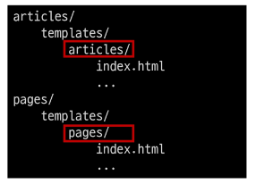

## 목차

1. Namespace
2. Django Model
3. Queryset API
4. CRUD with view functions
5. Admin site

## URL 정규화

- 문법적으로 서로 다른 문자열의 URL들이 동일 자원을 나타낼 수 있다. URL 정규화는 동일 자원을 나타내는 서로 다른 URL들을 통일된 형태로 변환하는 과정이다.

## Namespace

- 개체를 구분할 수 있는 범위를 나타내는 이름 공간
- Namespace의 필요성 → 2가지 문제 발생
    1. 첫번째 앱의 index 페이지에 작성한 두번째 앱 index로 이동하는 하이퍼 링크 클릭 시 → 현재 페이지로 다시 이동 ⇒ URL Namespace
    2. 두번째 앱의 URL로 직접 이동해도 첫번째 앱의 index 페이지가 출력됨 ⇒ Template namespace

### URL Namespace

- 두번째 앱 index로 이동하는 링크 클릭 시 해당 페이지로 다시 이동하는 문제 발생
- 서로 다른 앱에서 동일한 URL 이름을 사용하는 경우 **앱의 이름을 지정**하여 URL을 고유하게 사용할 수 있도록 변경
- **app_name** attribute 작성해 URL namespace 설정
- `app_name` 지정 후에는 url 태그에서 반드시 위와 같은 형식으로만 작성해야 함
- `` ⇒ ``
- app_name 지정 후에는 URL 태그에서 반드시 `app_name:url_name` 형태로만 사용해야 함
- 그렇지 않으면 *NoReverceMatch* 에러 발생 ⇒ URL 태그 문제

### Template Namespace

- 장고는 기본적으로 **app_name/templates/** 경로에 있는 파일들만 찾을 수 있으며, [settings.py](http://settings.py) 에 작성한 순서대로 template 검색 후 렌더링 함
    - 장고 입장에서는 *articles/templates/index.html* 과 *pages/templates/index.html* 을 구분할 수가 없음 → *app_name/templates/* 이후부터 인식하기 때문
    - *articles/template* 와 *pages/templates* 에 둘 다 *index.html*이 있으면 프로젝트의 *settings.py*에 등록되어 있는 순서대로 *index.html*을 주게 된다. 우리는 *articles>pages* 순서대로 등록되어 있다면 *pages/index.html*은 영원히 볼 수 없게 된다.
- 장고는 항상 *articeles/templates*와 *pages/templates*를 디폴트로 설정하고 값을 읽게 됨 → (urls.py)에서 (index/처럼)
- Django templates 기본 경로에 앱과 같은 이름의 폴더를 생성 **app_name/templates/app_name** 형태로 변경
- Django templates의 기본 경로(app_name/templates/) 자체를 변경할 수는 없기 때문에 물리적인 이름 공간으로 분리하는 것

