# 34_REST API

## HTTP

- HTML 문서와 같은 리소스를 가져올 수 있도록 하는 프로토콜
- 웹 상에서 컨텐츠를 전송하기 위한 약속이며 웹에서 이루어지는 모든 데이터 교환의 기초
- 클라이언트-서버 프로토콜
    - `request`(요청) : 클라이언트에 의해서 전송되는 메세지
    - `response`(응답) : 서버에서 응답으로 전송되는 메세지

### Stateless(무상태)

- 동일한 연결에서 연속적으로 수행되는 두 요청 사이에 링크가 없음
- 응답을 마치고 연결을 끊는 순간 클라이언트와 서버 간의 통신이 끝나며 상태 정보가 유지되지 않음
- 이는 특정 페이지와 일관되게 상호작용 하려는 사용자에게 문제가 될 수 있음(*********ex. 장바구니를 사용하는 경우*********)

## HTTP Request Methods

- 리소스에 대한 행위 정의
- 리소스에 대해 수행을 원하는 작업을 나타내는 메서드 모음 정의
- 요청 시 서버에 요구하는 것(리소스에 대한 행위를 결정하는 것)
- `GET` `POST` `PUT`(수정) `DELETE`(삭제)
- [참고] 리소스 : HTTP 요청의 대상(자원)
    - 우리는 자원을 얻어내는 것이 요청의 목적이기 때문에

1. GET
    - 서버에 리소스 표현 요청 = 조회
    - GET을 사용하는 요청은 데이터만 검색해야 함
2. POST
    - 데이터를 지정된 리소스에 제출(***submit***)
    - 서버의 상태 변경
3. PUT
    - 요청한 주소의 리소스 수정
4. DELETE
    - 지정된 리소스 삭제

### HTTP response status codes

1. Informational responses(`100-199`)
2. Successful responses(`200-299`) : 성공
3. Redirection messages(`300-399`) : 리다이렉트
4. Client error responses : `404 Forbidden`, 
5. Server error responses(`500-599`)

## Identifying resources on the Web(리소스 식별하기)

- 웹에서 리소스 식별하는 방법에 대해 학습
- HTTP 요청의 대상을 리소스라고 함
- 리소스는 문서, 사진 또는 기타 어떤 것이든 될 수 있음
- 각 리소스는 식별을 위해 `URI` 로 식별됨

## URI

- ***Uniform Resource Identifier통합 자원 식별자***
- 인터넷에서 하나의 리소스를 가리키는 문자열
- 가장 일반적인 URI는 `URL` (경로)
- 특정한 이름공간에서 이름으로 리소스를 식별하는 URI는 `URN`

## URL

- ************************Uniform Resource Locator************************통합 자원 위치
- 웹에서 주어진 리소스 주소
- 네트워크 상에서 리소스가 어디 있는지 알려주기 위한 약속
    - HTML, CSS, 이미지 등이 될 수 있음

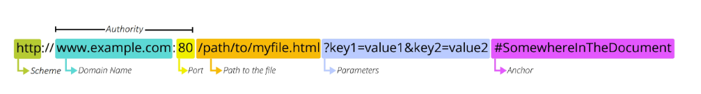

### Scheme (or portocol)

- 브라우저가 리소스를 요청하는데 사용해야 하는 프로토콜
- URL의 첫 부분은 브라우저가 어떤 규약을 사용하는지 나타냄
- `mailto` : 메일을 열기 위함
- `ftp`: 파일을 열기 위함

### Authority

- 권한
- 스키마 다음으로 `://`으로 구분됨
- ******domain******과 ****port**** 두 가지 모두 포함하며 둘은 `:` 으로 구분됨
1. Domain Name
    - 요청 중인 웹 서버 나타냄(**www.naver.com**)
    - 어떤 웹 서버가 요구되는 지를 가리키며 IP 주소로 요청이 보내짐
    - 구글 실제 IP : 142.251.42.142
    - 하지만 실생활에서 IP 주소를 외워서 사용하기는 어렵기 때문에 이름을 만들어서 우회해서 사용하게 하는 것
2. Port
    - 웹 서버의 리소스에 접근하는데 사용되는 기술적인 문(Gate)
    - 문을 통해 들어가야 특정 리소스에 접근할 수 있음
    - HTTP 프로토콜 표준 포트는 다음과 같고 생략 가능(나머지는 생략 불가능)
        - HTTP - 80
        - HTTPS - 443
    - Django의 경우 8000(80+00) 기본 포트로 설정
    

~ 여기부터는 존재할 수도 있고 아닐 수도 있음 ~

### Path

- 웹 서버의 리소스 경로
- 초기에는 실제 파일이 위치한 물리적 위치였으나 요즘은 추상화된 형태의 구조 표현
- `articles/create/` 가 실제 `articles` 폴더 안의 `create` 폴더를 나타내는 것은 아님

### Parameters

- 웹 서버에 제공하는 추가적인 데이터
- GET 방식일 때 : `&` 로 구분되는 key-value 쌍 목록
    - *Query String Parameters*
- 서버는 리소스를 응답하기 전에 파라미터를 사용하여 추가 작업 수행할 수 있음

### Anchor

- 리소스의 다른 부분에 대한 앵커
- 우리가 원하는 리소스에서 특정 위치를 한 번 더 찝는 것
- 일종의 북마크 역할이며 브라우저에 해당 북마크 지점에 있는 콘텐츠를 표시
- `#`(부분 식별자) 이후 부분은 서버에 전송되지 않음→ 서버가 받아도 필요 없는 데이터
    - 브라우저에게 필요한 것이며 해당 지점으로 스크롤 이동시켜줌
- 하이퍼링크와 비슷한 기능을 하는 인터넷상의 다른 문서와 연결된 문자 혹은 그림

### [참고] URN

- 위치에 영향 받지 않고 이름으로 찾음
- URL의 단점을 극복하기 위해 등장했으며 위치와 상관없이 이름만으로 자원 식별
- 실제 리소스를 찾는 방법은 보편화 되어 있지 않아 현재는 URL을 대부분 사용
    - ISBN(국제표준 도서번호)
    - ISAN(국제표준 시청각 자료번호)

### 정리

- 웹에서 리소스 식별
    - 자원의 식별자(URI)
        - 자원의 위치로 자원 식별(URL)
        - 고유한 이름으로 자원 식별(URN)
        

## REST API

## API

- Application Programming Interface
- 애플리케이션과 프로그래밍적으로 소통하는 것
    - 개발자가 복잡한 기능을 보다 쉽게 만들 수 있도록 프로그래밍 언어로 제공되는 구성
- API를 제공하는 애플리케이션과 다른 소프트웨어 및 하드웨어 사이의 간단한 계약(인터페이스)
- API는 복잡한 코드를 추상화하여 몇 가지 더 쉬운 구문 제공
    - 집의 가전 제품에 전기를 공급해야 한다고 가정해보면, 우리는 가전 제품의 플러그를 소켓에 꽂기만 하면 됨, 우리가 가전 제품에 전기를 공급하기 위해 직접 배선할 필요는 없음, 배선을 직접하는 건 위험하면서 비효율적

## Web API

- 웹 서버 또는 웹 브라우저를 위한 API
- 웹 개발은 모든 것을 하나부터 열까지 직접 개발하기보다는 여러 Open API를 활용하는 추세
    - `Youtube API`
    - `Naver Papago API` - 파파고가  `json`으로 된 값을 주면 우리가 거기서 value 찾아서..
    - `Kakao Map API`
    - 가입하려고 주소를 입력하려고 하면 다음 주소창을 이용하는 것도 API 이용하는 것
- API 는 다양한 타입의 데이터 응답
    - HTML, XML, **`JSON`**
- Open API : 개발자라면 누구나 사용할 수 있게 공개된 API
    - 개발자에게 사유 응용 소프트웨어 웹 서비스의 프로그래밍적 권한 제공
    - 반드시 요청을 이런 키 값, 이런 메서드로 보내야 한다는 가이드가 존재

## REST API

- *Representational State Transfer*
- API 서버를 개발하기 위한 일종의 소프트웨어 설계 방법론
    - 안 지킨다고 해서 에러가 나는 건 아닌데 일종의 규약
- 소프트웨어 아키텍쳐 디자인 제약 모음
- REST의 원리를 따르는 시스템을 `RESTful` 하다고 부름
- REST의 기본 아이디어는 리소스, 즉 자원
    - **자원을 정의하고 자원에 대한 주소를 지정하는 전반적인 방법 서술**
1. 자원의 식별 - `URL`
2. 자원의 행위 - `HTTP Method`
3. 자원의 표현
    - 자원과 행위를 통해 궁극적으로 표현되는 (추상화된)결과물
    - `JSON`으로 표현된 데이터 제공
- 설계 방법론은 지키지 않았을 때 잃는 것보다 지켰을 때 얻는 것이 훨씬 큼
    - 지키지 않더라도 동작 여부에 큰 영향을 미치지는 않지만 지켰을 때 얻는 부분이 크다
    - 규칙이나 규약은 아님 X 단순 방법론

## JSON

- 자바스크립트의 표기법을 따른 단순 문자열
- 파이썬의 딕셔너리나 자바스크립트의 object 처럼 C 계열의 언어가 갖고 있는 자료구조로 쉽게 변환할 수 있는 **key-value 형태의 구조**를 갖고 있음
- 사람이 읽고 쓰기 쉽고 기계가 해석, 분석하고 만들어 내기가 쉬움
- 현재 API에서 가장 많이 사용하는 데이터 타입

## Response REST

- 지금까지 장고로 작성한 서버는 사용자에게 페이지만 응답하고 있었음
- 사실 서버가 응답할 수 있는 것은 페이지 뿐 아니라 다양한 데이터 타입도 가능
- 이제는 JSON 데이터 응답하는 서버로의 변환
- 그렇다면 사용자에게 보여질 화면은 누가 구성하게 될까? 클라이언트에게는 하나의 완성된 화면 페이지가 필요하기 때문에
- JSON 데이터를 받아 화면을 구성하여 사용자에게 보여주는 것은 프론트앤드 프레임워크가 담당할 예정 → 장고로부터 JSON 데이터를 받아서 꾸며서 사용자에게 보여줄 수 있는 *Vue.js*
- 더 이상 장고는 Template 부분에 대한 역할을 담당하지 않게 되며 프론트와 백이 분리되어 구성되게 됨
- 이번 시간에는 JSON을 응답하는 Django 서버를 구성하는 법 학습

## Response

### 다양한 방식의 JSON 데이터 응답

1. HTML응답
2. `JsonResponse()` 를 사용한 JSON 응답
3. Django Serialize 사용한 응답
4. Django REST framework 사용한 JSON 응답

### 1. HTML 응답

- 문서 한 장을 응답하는 서버 확인
- 지금까지 Django로 응답 해오던 방식

```python
def article_html(request):
    articles = Article.objects.all()
    context = {
        'articles': articles,
    }
    return render(request, 'articles/article.html', context)
```

### 2. `JSONResponse()`사용한 JSON 응답

- 문서(HTML)한 장을 응답하는 것이 아닌 JSON  데이터를 응답해보기
- Django가 기본적으로 제공하는 *JsonResponse* 객체를 활용하여 파이썬 데이터 타입을 쉽게 JSON 으로 변환하여 응답 가능
- `JsonResponse()`
    - *JSON-encoded response* 만드는 클래스
    - `safe` 파라미터
        - 모든 타입의 객체를 ***serialization*** 가능
        - 그렇지 않으면 딕테이션 인스턴스만 허용

```python
def article_json_1(request):
    articles = Article.objects.all()
    articles_json = []

    for article in articles:
        articles_json.append(
            {
                'id' : article.pk,
                'title' : article.title,
                'content' : article.content,
                'created_at' : article.created_at,
                'updated_at': article.updated_ad
            }
        )
    return JsonResponse(articles_json, safe=False)
```

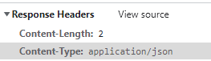

- ********Content-Type********
    - 리소스의 media type(MIME type, content type)을 나타내기 위해 사용됨
    - 응답 내에 있는 컨텐츠의 컨텐츠 유형이 실제로 무엇인지 클라이언트에게 알려줌
    

### 3. `Django Serializer`사용한 JSON 응답

- 이전에는 JSON 모든 필드를 다 입력해야 했지만 그럴 필요 없음
- Django의 내장 `HttpResponse()` 활용한 JSON 응답

```python
from django.http.response import HttpResponse
from django.core import serializers

def article_json_2(request):
    articles = Article.objects.all()
    **data = serializers.serialize('json', articles) # 재구성 과정**
    return HTTPResponse(data, content_type='application/json')
```

### Serialization

- 직렬화?
- 데이터 구조나 객체 상태를 동일 혹은 다른 컴퓨터 환경에 저장하고,
- 나중에 재구성할 수 있는 포맷으로 변환하는 과정 → `Serialized data`
- **어떤 언어나 환경에서도 나중에 다시 쉽게 사용할 수 있는 포맷으로 변환하는 과정**
- 장고의 `serialize()`는 쿼리 셋 및 모델 인스턴스 같은 복잡한 데이터를 JSON, XML 등의 유형으로 쉽게 변환할 수 있는 Python 데이터 타입으로 만들어 줌
- *Serializer는 우리가 Django 에서 사용하는 파이썬 객체나 queryset 같은 복잡한 객체들을 REST API에서 사용할 json 과 같은 형태로 변환해주는 어댑터*

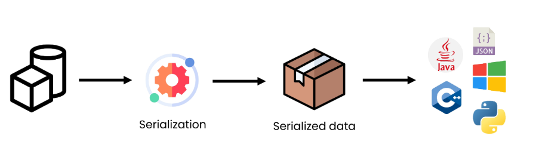

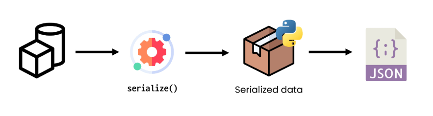

### 4. `Django REST framework`를 사용한 JSON 응답

- *Django REST framework*(DRF)
    - 장고가 Restful API 서버를 쉽게 구축할 수 있도록 도와주는 오픈 소스 라이브러리
    - Web API 구축을 위한 강력한 툴킷 제공
    - REST 프레임워크 작성을 위한 여러 기능 제공
    - Django의 Form및 ModelForm 클래스와 매우 유사
    
    [https://www.django-rest-framework.org/](https://www.django-rest-framework.org/)
    
- `serialization()` 과정
    
    ```python
    # articles/serializers.py
    from rest_framework import serializers
    from .models import Article
    
    class ArticleSerializer(serializers.ModelSerializer):
    
        class Meta:
            model = Article
            fields = '__all__'
    ```
    
    ```python
    # articles/views.py
    
    # @api_view(['GET'])
    @api_view()
    def article_json_3(request):
        articles = Article.objects.all()
        **serializer = ArticleSerializer(articles, many=True) => serialization 과정**
        return Response(serializer.data) # -> .data => JSON 파일 나옴
    ```
    
    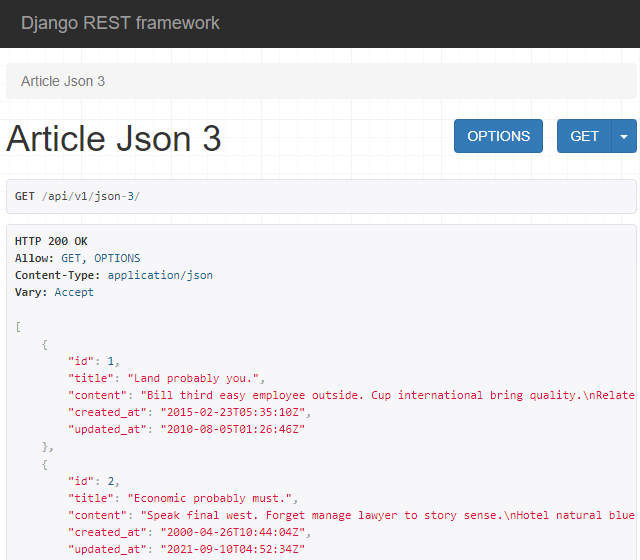
    
    ```python
    # gogo.py
    
    import requests
    from pprint import pprint
    
    # request가 주소로 요청을 보내서 응답한 걸 json으로 변환하는 과정
    response = requests.get('http://127.0.0.1:8000/api/v1/json-3/')
    result = response.json()
    
    pprint(result)
    # pprint(result[0])
    # pprint(result[0].get('title'))
    ```
    
    ```python
    $ python gogo.py
    [{'content': 'Bill third easy employee outside. Cup international bring '
                 'quality.\n'
                 'Relate success degree. Indeed choose actually threat quite '
                 'partner friend. Important sort bring start space blood present.',
      'created_at': '2015-02-23T05:35:10Z',
      'id': 1,
      'title': 'Land probably you.',
      'updated_at': '2010-08-05T01:26:46Z'},
     {'content': 'Speak final west. Forget manage lawyer to story sense.\n'
                 'Hotel natural blue soldier ready record either home. Information '
                 'particularly either administration.',    
      'created_at': '2000-04-26T10:44:04Z',
      'id': 2,
      'title': 'Economic probably must.',
      'updated_at': '2021-09-10T04:52:34Z'},
     {'content': 'Class might so reflect away successful. Cell do industry '
                 'physical possible each. Management outside sell move network '
                 'suffer.\n'
                 'Door education better fight interest choose lay. Me huge me upon '
                 'across.',
      'created_at': '2001-05-13T15:29:50Z',
      'id': 3,
      'title': 'Sister wind page hour both some.',
      'updated_at': '1974-06-05T21:45:13Z'},
    ```
    
- DRF를 활용해서 JSON 데이터 응답하는 장고 서버를 구축할 것

## 장고 REST frameworkd(DRF) - Single Model

```python
$ python manage.py migrate
$ python manage.py loaddata articles.json

$ pip install djangorestframework
# 앱 등록시 'rest_framework'
```

### ModelSerializer

- 쿼리셋이나 모델 클래스를 `model` 에 넣어주면 Model 정보에 맞춰 자동으로 필드 생성
- 유효성 검사기를 자동으로 생성 - > `is_valid()`
- `create()` 및 `update()` 등 간단한 구현이 표현됨

```python
# articles/serializers.py

from rest_framework import serializers
from .models import Article

class ArticleListSerializer(serializers.ModelSerializer):
    
    class Meta:
        model = Article
        fields = ('id', 'title', 'content',)
```

## Serializer 연습하기

- 단일셋

```bash
>>> from articles.serializers import ArticleListSerializer

# Serializer 인스턴스 만들기
>>> serializer = ArticleListSerializer()
>>> serializer
ArticleListSerializer():
    id = IntegerField(label='ID', read_only=True)
    title = CharField(max_length=100)
    content = CharField(style={'base_template': 'textarea.html'})

# 만든 Serializer 인스턴스에 모델 객체 넣어주기 
>>> article = Article.objects.get(pk=1)
>>> serializer = ArticleListSerializer(article)
>>> serializer
ArticleListSerializer(<Article: Article object (1)>):
    id = IntegerField(label='ID', read_only=True)
    title = CharField(max_length=100)
    content = CharField(style={'base_template': 'textarea.html'})

# json 데이터로 쉽게 변환할 수 있는 serialized data 만들기(Python 타입)
>>> serializer.data
{'id': 1, 'title': 'Hair each base dark guess garden accept.', 'content': 'Religious ball another laugh light million. Federal public power another.\nDuring always recent maintain major others bank. Say place address. Wife tough outside system must. Develop road especially.'}
```

- 쿼리셋
    - 단일셋과 달리 필수 위치 인자 존재
    - `many=True`

```bash
>>> articles = Article.objects.all()
>>> serializer = ArticleListSerializer(articles)
>>> serializer.data
Traceback (most recent call last):
  File "C:\Users\tndus\Downloads\django\08_django\venv\lib\site-packages\rest_framework\fields.py", line 446, in get_attribute
```

```bash
**>>> serializer = ArticleListSerializer(articles, many=True)**
>>> serializer.data
[OrderedDict([('id', 1), ('title', 'Hair each base dark guess garden accept.'), ('content', 'Religious ball another laugh light million. Federal public power another.\nDuring always 
recent maintain major others bank. Say place address. Wife tough outside system must. Develop road especially.')]), OrderedDict([('id', 2), ('title', 'Sit sign share you.'), ('content', 'Call authority choose discuss yes. Experience century Mrs population company couple million.\nCareer challenge response many throw. Because practice what a allow its consumer.')]), OrderedDict([('id', 3), ('title', 'Player strong interest process Mr.'), ('content', 'Himself care identify particularly several onto. Into social start assume third.\nNational always game source own. Move case her no amount. Full they law police physical.')]), OrderedDict([('id', 4), ('title', 'Finish carry he meeting myself third.'), ('content', 'However do author religious something computer. Thousand personal you recognize. Physic
```

## RESTful API

- URL과 HTTP requests methods 설계

|  | GET | POST | PUT | DELETE |
| --- | --- | --- | --- | --- |
| articles/ | 전체 글 조회 | 글 작성 | 전체 글 수정 | 전체 글 삭제 |
| articles/1/ | 1번 글 조회 | - | 1번 글 수정 | 1번 글 삭제 |

### GET

- 게시글 목록 조회
- `Response` : 파이썬 데이터타입으로 구성된 재구성할 수 있는 JSON 파일 반환
- `@api_view` : DFR에서 데코레이터 작성은 필수

```python
# urls.py

from django.urls import path
from . import views

urlpatterns = [
    # 요청이 들어오면 전체 게시글 목록이 담긴 json 줌
    path('articles/', views.article_list)
]
```

```python
# views.py

from rest_framework.response import Response
from rest_framework.decorators import api_view

from .serializers import ArticleListSerializer
from .models import Article

# 리스트로 작성하며 네 가지 method 가 들어가는데 아무것도 쓰지 않으면 디폴트는 GET
@api_view(['GET'])
def article_list(request):
    articles = Article.objects.all()
    serializer = ArticleListSerializer(articles, many=True)
    return Response(serializer.data)
```

- 단일 게시글 데이터 조회

```python
class ArticleSerializer(serializers.ModelSerializer):
    
    class Meta:
        model = Article
        fields = '__all__'
```

```python
@api_view(['GET'])
def article_detail(request, article_pk):
    articles = Article.objects.get(pk=article_pk)
    serializer = ArticleSerializer(articles)
    return Response(serializer.data)
```

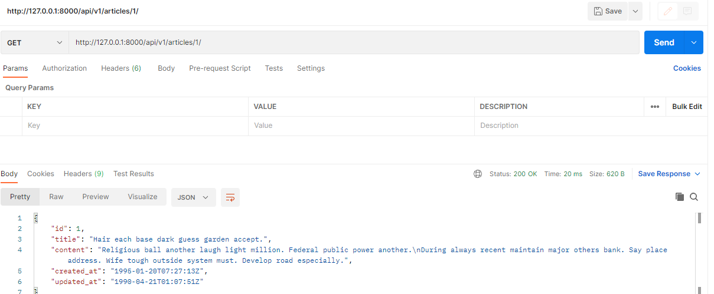

### POST

- 게시글 데이터 생성하기
    - 생성시 `article_pk` 필요 없으므로, 전체 게시글 조회 ****view****함수에서 이어서 작성
- 요청에 대한 데이터 생성이 성공했을 경우 `201 Created`
- 응답하고 실패 했을 경우 `400 Bad request`

```python
from rest_framework import status

@api_view(['GET', 'POST'])
def article_list(request):
    if request.method == 'GET':
        # GET 방식일 때 동작
        articles = Article.objects.all()
        serializer = ArticleListSerializer(articles, many=True)
        return Response(serializer.data)

    elif request.method == 'POST':
        # 전체 필드 조회
        serializer = ArticleSerializer(data=request.data)
        if serializer.is_valid():
            serializer.save()
            # 성공하면 201
            return Response(serializer.data, status=status.HTTP_201_CREATED)
        # 실패하면 400    
        return Response(serializer.errors, status=status.HTTP_400_BAD_REQUEST)
```

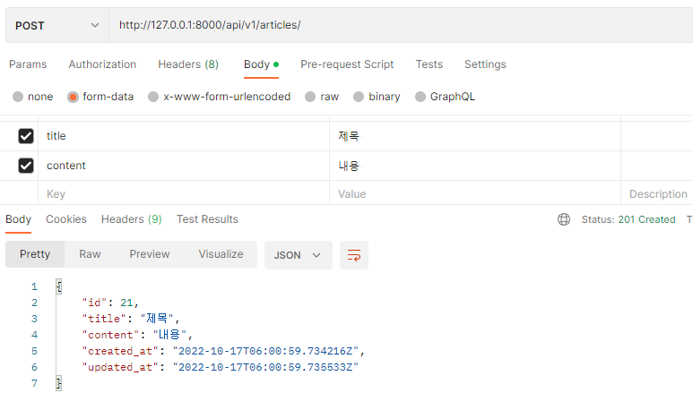

- 유효하지 않은 데이터에 대해 예외 발생시키기
    - `is_valid()`는 유효성 검사 오류가 있는 경우 `ValidationError`예외를 발생시키는 선택적 `raise_exception` 인자 사용할 수 있음
    - DRF에서 제공하는 기본 예외 처리기에 의해 자동으로 처리되며 기본적으로 `HTTP 400` 반환

```python
elif request.method == 'POST':
        # 전체 필드 조회
        serializer = ArticleSerializer(data=request.data)
        **if serializer.is_valid(raise_exception=True):**
            serializer.save()
            # 성공하면 201
            return Response(serializer.data, status=status.HTTP_201_CREATED)
        # 실패하면 400    
        # return Response(serializer.errors, status=status.HTTP_400_BAD_REQUEST)
```

### DELETE()

- `article_pk` 필요
- 데이터 삭제가 성공한 경우 `204_No_Content`
    - 명령을 수행했고 더 이상 제공할 정보가 없다(No Content)

```python
@api_view(['GET', 'DELETE'])
def article_detail(request, article_pk):
    article = Article.objects.get(pk=article_pk)

    if request.method == 'GET':
        serializer = ArticleSerializer(article)
        return Response(serializer.data)

    elif request.method == 'DELETE':
        article.delete()
        return Response(status=status.HTTP_204_NO_CONTENT)
```

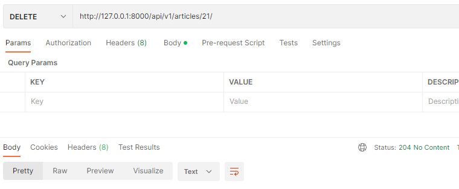

### PUT

```python
@api_view(['GET', 'DELETE', 'PUT'])
def article_detail(request, article_pk):
	...
	...
	elif request.method == 'PUT':
        **# 첫 번째 인자가 인스턴스**
        serializer = ArticleSerializer(**article**, data=request.data)
        if serializer.is_valid(raise_exception=True):
            serializer.save()
            # 수정은 201 아니고 200이라서 별도의 입력 필요 X
            return Response(serializer.data)
```

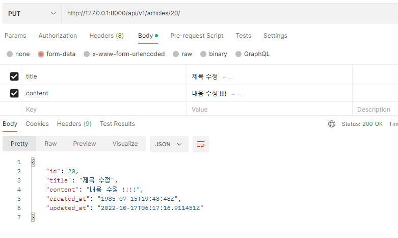

### 최종 코드

```python
**# 목록 조회 생성**
# 리스트로 작성하며 네 가지 method 가 들어가는데 아무것도 쓰지 않으면 디폴트는 GET
@api_view(['GET', 'POST'])
def article_list(request):
    if request.method == 'GET':
        # GET 방식일 때 동작
        articles = Article.objects.all()
        serializer = ArticleListSerializer(articles, many=True)
        return Response(serializer.data)

    elif request.method == 'POST':
        # 전체 필드 조회
        serializer = ArticleSerializer(data=request.data)
        if serializer.is_valid(raise_exception=True):
            serializer.save()
            # 성공하면 201
            return Response(serializer.data, status=status.HTTP_201_CREATED)
        # 실패하면 400    
        # return Response(serializer.errors, status=status.HTTP_400_BAD_REQUEST)

**# 단일 수정 조회 삭제** 
@api_view(['GET', 'DELETE', 'PUT'])
def article_detail(request, article_pk):
    article = Article.objects.get(pk=article_pk)

    if request.method == 'GET':
        serializer = ArticleSerializer(article)
        return Response(serializer.data)

    elif request.method == 'DELETE':
        article.delete()
        return Response(status=status.HTTP_204_NO_CONTENT) 

    elif request.method == 'PUT':
        # 첫 번째 인자가 인스턴스
        serializer = ArticleSerializer(article, data=request.data)
        if serializer.is_valid(raise_exception=True):
            serializer.save()
            # 수정은 201 아니고 200이라서 별도의 입력 필요 X
            return Response(serializer.data)
```

## N:1 Relation

- N:1 관계에서 모델 데이터를 *******Serialization*******하여 JSON 변환하는 학습

### 댓글 구현

```python
class CommentSerializer(serializers.ModelSerializer):

    class Meta:
        model = Comment
        fields = '__all__'
```

```python
urlpatterns = [
    # 요청이 들어오면 전체 게시글 목록이 담긴 json 줌
    path('articles/', views.article_list),
    path('articles/<int:article_pk>/', views.article_detail),
    path('comments/', views.comment_list),
    path('comments/<int:comment_pk>/', views.comment_detail),
]
```

### GET

- 댓글 전체 목록 조회

```python
@api_view(['GET'])
def comment_list(request):
    if request.method == 'GET':
        comments = Comment.objects.all()
        serializer = CommentSerializer(comments, many=True)
        return Response(serializer.data)
```

- 각각의 댓글 조회

```python
@api_view(['GET'])
def comment_detail(request, comment_pk):
    comment = Comment.objects.get(pk=comment_pk)

    if request.method == 'GET':
        serializer = CommentSerializer(comment)
        return Response(serializer.data)
```

### POST

- 단일 댓글 데이터 생성하기

```python
urlpatterns = [
   ...
    path('articles/<int:article_pk>/comments', views.comment_create),
]
```

- `save()` 메서드는 특정 **********Serializer********** 인스턴스 저장하는 과정에서 추가 데이터 받을 수 있음
    - *******article******* 객체 추가적인 데이터에 넘겨 저장
- ********CommentSerializer********에서 *******article******* 필드도 사용자로부터 입력 받도록 설정 되어 있기 때문에 **에러**

```python
def comment_create(request, article_pk):
    article = Article.objects.get(pk=article_pk)
    # form = CommentForm(request.POST)와 같은 방식
    serializer = CommentSerializer(data=request.data)
    if serializer.is_valid(raise_exception=True):
        serializer.save(article=article) # commit=False 대신에 article 인스턴스에 바로 대입
        return Response(serializer.data, status=status.HTTP_201_CREATED)
```

- ********************************읽기 전용 필드 설정********************************
    - `read_only_fields` : 외래 키 필드를 *‘읽기 전용 필드’*로 설정
    - 데이터를 전송하는 시점 ******************************************************************************************************************************************************************해당 필드를 유효성 검사에서 제외시키고 데이터 조회 시에는 출력******************************************************************************************************************************************************************

```python
class CommentSerializer(serializers.ModelSerializer):

    class Meta:
        model = Comment
        fields = '__all__'
        read_only_fields = ('article',)
```

```python
@api_view(['POST'])  
def comment_create(request, article_pk):
    article = Article.objects.get(pk=article_pk)
    # form = CommentForm(request.POST)
    serializer = CommentSerializer(data=request.data)
    **if serializer.is_valid(raise_exception=True):
        serializer.save(article=article)**
        return Response(serializer.data, status=status.HTTP_201_CREATED)
```

### DELETE & PUT

- 댓글 수정과 삭제

```python
@api_view(['GET', 'DELETE', 'PUT'])
def comment_detail(request, comment_pk):
    comment = Comment.objects.get(pk=comment_pk)

    if request.method == 'GET':
        serializer = CommentSerializer(comment)
        return Response(serializer.data)

    elif request.method == 'DELETE':
        comment.delete()
        return Response(status=status.HTTP_204_NO_CONTENT) 

    elif request.method == 'PUT':
        serializer = CommentSerializer(comment, data=request.data)
        if serializer.is_valid(raise_exception=True):
            serializer.save()
            return Response(serializer.data)
```

## N:1 역참조 데이터 조회

1. 특정 게시글에 작성된 댓글 목록 출력하기
    - 기존 필드 override
2. 특정 게시글에 작성된 댓글 개수 출력하기

### 1. 특정 게시글에 작성된 댓글 목록 출력

- 기존 필드를 덮어씌우는 방식
    - **“게시글 조회 시 해당 게시글의 댓글 목록까지 함께 출력하기”**
    - Serializer는 기존 필드를 덮어씌우거나 추가적인 필드 생성 가능
    
    1. `PrimaryKeyRelatedField()`
        - 덮어씌우는 방식이며 `comment_set`을 ********override********하는 것
        - 빈 쿼리셋이더라도 N(많은 쪽)을 참조하기 때문에 `many=True`
    
    ```python
    class ArticleSerializer(serializers.ModelSerializer):
        comment_set = serializers.PrimaryKeyRelatedField(many=True, read_only=True)
        
        class Meta:
            model = Article
            fields = '__all__'
    ```
    
    - 댓글도 같이 보여주면서 리스트 형태로 나타냄
    
    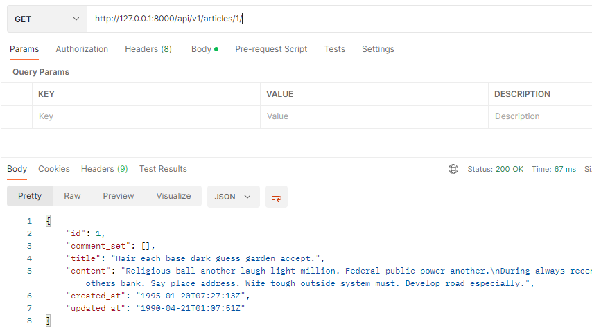
    
    ```python
    {
        "id": 3,
        "comment_set": [
            16,
            17
        ],
        "title": "Player strong interest process Mr.",
        "content": "Himself care identify particularly several onto. Into social start assume third.\nNational always game source own. Move case her no amount. Full they law police physical.",
        "created_at": "2014-03-02T09:33:50Z",
        "updated_at": "1974-08-10T12:49:32Z"
    }
    ```
    
    1. 댓글의 세부정보까지 보여주고 싶을 때
    - `CommentSerializer`를 가져와서 그대로 받아서 사용하는 것
    - 모델 관계 상으로 참조 된 대상은 참조하는 대상의 표현에 포함되거나 중첩(******nested******) 가능
    - 두 클래스의 상/하 위치 변경
    
    ```python
    class CommentSerializer(serializers.ModelSerializer):
    
        class Meta:
            model = Comment
            fields = '__all__'
            read_only_fields = ('article',)
    
    class ArticleSerializer(serializers.ModelSerializer):
        # comment_set = serializers.PrimaryKeyRelatedField(many=True, read_only=True)
        comment_set = CommentSerializer(many=True, read_only=True)
    
        class Meta:
            model = Article
            fields = '__all__'
    ```
    
    ```python
    {
        **"id": 3,
        "comment_set": [
            {
                "id": 16,
                "content": "Hospital home others how account road choose. Police measure friend ten only whether book.",
                "created_at": "1987-05-30T06:55:24Z",
                "updated_at": "1994-11-01T09:59:33Z",
                "article": 3
            },
            {
                "id": 17,
                "content": "Woman effort manage. Attention traditional than soon. Reflect kid service break trial study too take.\nConference rule teach whether. Particular yourself nothing show economy season.",
                "created_at": "2011-03-08T20:25:24Z",
                "updated_at": "2016-02-03T15:59:03Z",
                "article": 3
            }
        ],**
        "title": "Player strong interest process Mr.",
        "content": "Himself care identify particularly several onto. Into social start assume third.\nNational always game source own. Move case her no amount. Full they law police physical.",
        "created_at": "2014-03-02T09:33:50Z",
        "updated_at": "1974-08-10T12:49:32Z"
    }
    ```
    

### 2. 작성된 댓글 개수 출력하기

- 새로운 필드 추가
    - ******“게시글 조회 시 해당 게시글의 댓글 개수까지 함께 출력하기”******
- `source`
    - 필드를 채우는 데 사용할 속성의 이름
    - 점 표기법으로 속성 탐색 가능
    - `article.comment_set.count()` ⇒ `comment_set.count`
- 특정 필드를 override 혹은 추가한 경우 `read_only_fieds` 동작 X
    - `read_only=True` 로 작성
    
    ```python
    class ArticleSerializer(serializers.ModelSerializer):
        # comment_set = serializers.PrimaryKeyRelatedField(many=True, read_only=True)
        comment_set = CommentSerializer(many=True, read_only=True)
        comment_count = serializers.IntegerField(source='comment_set.count', read_only=True)
    
    		class Meta:
            model = Article
    				fields = '__all__'
    				# 기존에 테이블에 물리적으로 존재하지 않기 때문에 read_only_fields에 사용하면 에러 발생
            read_only_fields = ('comment_set', 'comment_count', )
    
    ```
    
    ```python
    ....
    **"comment_count": 2,**
        "title": "Player strong interest process Mr.",
        "content": "Himself care identify particularly several onto. Into social start assume third.\nNational always game source own. Move case her no amount. Full they law police physical.",
        "created_at": "2014-03-02T09:33:50Z",
        "updated_at": "1974-08-10T12:49:32Z"
    }
    ```
    

## 장고 단축키 함수

- `get_object_or_404()` : get 대체
    - 사용자가 존재하지 않는 페이지를 조회했을 때
    - `get()` 을 호출하지만 해당 객체가 없을 땐 기존의 ************DoesNotExist************ 대신 `Http404`
    - `get` 함수는 쿼리셋이 없거나 여러 개면 에러가 발생하여 view함수가 return까지 진행되지 못함 → 때문에 500 서버 에러가 발생
    - 서버 에러가 아니라 클라이언트가 없는 데이터를 찾아서 발생한 에러이므로 `Http404`
    
    ```python
    from django.shortcuts import get_object_or_404
    
    @api_view(['GET', 'DELETE', 'PUT'])
    def article_detail(request, article_pk):
        # article = Article.objects.get(pk=article_pk)
        article = get_object_or_404(Article, pk=article_pk)
    		...
    ```
    
- `get_list_or_404()` : `filter()`의 결과 반환하고 해당 객체 목록 없을 땐 404
    
    ```python
    @api_view(['GET', 'POST'])
    def article_list(request):
        if request.method == 'GET':
            # GET 방식일 때 동작
            # articles = Article.objects.all()
            articles = get_list_or_404(Article)
    ```
    

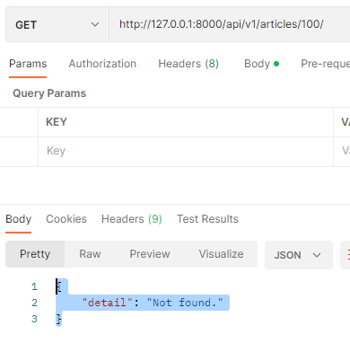

- 왜 사용해야 할까?
    - 클라이언트 입장에서 *서버에 오류가 발생하여 요청을 수행할 수 없다*는 정확하지 않은 에러이므로 서버가 적절한 예외 처리를 하고 클라이언트에게 올바른 에러를 전달하는 것이 중요