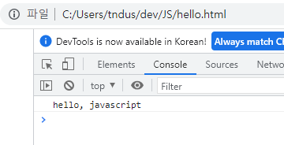
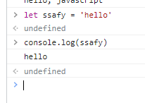

- JavaScript 시작하기
- JavaScript 기초 문법
    - JavaScript 문법
    - 세미콜론 / 들여쓰기 /코드 블럭
    - 스타일 가이드
    - 변수와 식별자
    - 타입과 연산자
    - 조건문
    - 반복문
- 함수
- Array와 Object
    - 배열
    - 객체

## JavaScript 시작하기

## JavaScript 배워야 하는 이유

- Web 기술의 기반이 되는 언어
    - HTML 문서의 콘텐츠를 동적으로 다양한 동작(채팅, 게임)을 할 수 있게 된 기반
- 다양한 분야로 확장이 가능한 언어
    - 처음에는 단순히 웹 페이지 동적 기능을 위해서 존재했으나
    - 현재는 블록체인, 게임 개발, 모바일 서비스 등등에 사용 됨 → 확장성
    - 이제는 프론트 분야를 넓어 다양한 직군에서 찾는 언어가 됨

## JavaScript 역사

- Web 브라우저와 같이 발전해왔다고 할 정도로 깊은 연관 관계가 있음

### 웹 브라우저의 역할

- URL을 통해 웹 탐색
- HTML/CSS/JavaScript 이해한 뒤 해석해서 사용자에게 꾸며서 하나의 화면으로 보여줌
- 웹 서비스 이용 시 클라이언트의 역할 → 서버에게 요청 보냄

### 웹 브라우저와 스크립트 언어

- 1993, Mosaic Web Brower
    - GUI 기반의 웹 브라우저
- 1994, Netscape Navigator
    - 시장 점유율 80퍼 차지
- 이때 까지만 해도 정적 웹 페이지를 단순히 보여주는 용도에 그침
- 동적으로 바꿔줄 Script 언어 개발 필요
    - Script 언어 : 컴파일러 없이 실행 가능한 언어, 속도가 느림
    - Script 언어인 Mocha 개발 → LiveScript → JavaScript(자바의 명성에 기대보고자)
- 1995, Internet Explorer
    - MS에서 개발한 웹 브라우저
    - JScript라는 언어 제작 후 이를 탑재
    - 이후 JavaScript와 JScript가 각자의 기능을 추가하기 시작 → 표준 개발의 필요성
- 1996-2000, ECMA 표준 발의
    - 정보 통신에 관한 규약을 만드는 ECMA → ECMAScript1 출시
    - MS가 시장의 95% 시장을 가지고 있어서 표준안을 지키지 않기 시작
    - OS 윈도우에 익스플로러 탑재
- 2001-2004, 다양한 웹 브라우저의 등장
    - Netscape → 모질라 재단(MDN) : 파이어폭스 웹 브라우저 출시
    - 이후 더 다양한 웹 브라우저가 출시 → 더더욱 많은 개발자가 필요 → 집단 지성 형성
- jQuery 라이브러리 등장
    - 하나의 웹 페이지를 위해서 너무 다양한 스크립트 작성하는 게 고통
    - 중간에 하나의 레이어를 두고 코딩하는 것 = jQuery
    - 브라우저별 엔진에 맞는 스크립트 변환을 해주는 것
- 2008, 구글과 크롬의 등장
    - V8 엔진을 탑재한 크롬의 등장
        - JavaScript 해석이 다른 웹 브라우저에 비해 월등히 빠름(속도)
        - 크롬이 다른 웹 브라우저들이 표준안을 만들자고 제안…
- 2015, ECMAScript6(`ES6`) → JavaScript의 대격변

### 정리

- 웹 브라우저는 자바스크립트 해석하는 엔진 가지고 있음
- 지금은 최대한 표준에 맞춰 개발 중
- jQuery등 라이브러리는 사용할 필요 없음(모든 웹 브라우저가 표준안 따름)
- 크롬의 V8 경우 자바스크립트 번역하는 속도가 매우 빠름
    - 웹 브라우저 말고 다른 개발에서도 사용해보자!
    - *node.js*(웹 브라우저 밖에서도 실행할 수 있도록 꺼낸 계기), *********************react.js, electro…*********************
    - 웹만 담당하던 언어에서 지금은 서버 등 다양한 분야로

## 자바스크립트 실행환경

- 웹 브라우저로 실행하기
    - HTML 파일에 포함시키기
        
        ```html
        <!DOCTYPE html>
        <html lang="en">
        <head>
            <meta charset="UTF-8">
            <meta http-equiv="X-UA-Compatible" content="IE=edge">
            <meta name="viewport" content="width=device-width, initial-scale=1.0">
            <title>Document</title>
        </head>
        <body>
            <script>
                console.log('hello, javascript')
            </script>
        </body>
        </html>
        ```
        
        
        
    - `.js` 확장자를 가진 파일로 실행시키기
        
        ```jsx
        /* hello.js */
        
        console.log('hello, javascript')
        ```
        
        ```html
        <!DOCTYPE html>
        <html lang="en">
        <head>
            <meta charset="UTF-8">
            <meta http-equiv="X-UA-Compatible" content="IE=edge">
            <meta name="viewport" content="width=device-width, initial-scale=1.0">
            <title>Document</title>
        </head>
        <body>
        
        </body>
        <script src="hello.js"></script>
        </html>
        ```
        
    - 웹 브라우저의 콘솔에서 바로 자바스크립트 실행하기



- node.js 로 실행시키기
    - 웹 브라우저에서 바로 실행할 수 있는 자바스크립트 문법들을 *Vanilla JavaScript*
    - 웹 브라우저를 이용하지 않고 자바스크립트 실행 가능
        
        ```html
        $ node -v
        $ npm -v
        
        $ node hello.js
        ```
        

## JavaScript 문법

- 세미콜론
    - 자바스크립트 선택적 사용 가능
    - ASI (자동 세미콜론 삽입 규칙)에 의해 자동으로 세미콜론 삽입됨
- 들여쓰기
    - 자바스크립트는 2칸 들여쓰기
- 코드 블록(*****Block*****)
    - `{}` 사용해서 코드 블록(*Block*) 구분
    
    ```jsx
    if (isClean) {
    	console.log('clean!')
    }
    ```
    
- 주석
    - 한 줄 주석(`//`) 과 여러 줄 주석(`/* */`)
    
- 코드 스타일 가이드
    - 코딩 스타일의 핵심은 합의된 원칙과 일관성
    - 굉장히 다양한 종류의 스타일 가이드 존재
    - 수업에서는 **************Airbnb Style Guide************** 기반으로 사용할 것
    
    [https://github.com/airbnb/javascript](https://github.com/airbnb/javascript)
    
    - 코드의 품질에 직결되는 중요한 요소
        - 코드의 가독성, 유지보수, 팀원과의 커뮤니케이션 등 개발 과정 전체에 영향 끼침
    - *Python*에서 PEP8 이라는 코드 스타일 가이드가 있었듯, *JavaScript*에도 스타일 가이드 존재
    

### 변수와 식별자

- 식별자 정의와 특징
    - 식별자 : 변수를 구분할 수 있는 변수명
    - 식별자는 반드시 문자, 달러(`&`), 밑줄(`_`)로 시작
    - 대소문자 구분하며, 클래스명 외에는 모두 소문자로 시작
    - 예약어 사용 불가능 : *****************for, if, function*****************
- 카멜 케이스(****************************`camelCase`, lower-camel-case*)
    - 변수, 객체, 함수에 사용
    - 언더바(`_`)대신에 중간중간에 대문자로 사용
    
    ```jsx
    // 변수
    let dog
    let variableName
    
    // 객체
    const userInfo
    ```
    
- 파스칼 케이스(*`PascalCase`, upper-camel-case*)
    - 클래스, 생성자에 사용
- 대문자 스네이크 케이스(`*SNAKE_CASE*`)
    - 상수(*********constants*********)에 사용
    - 개발자의 의도와 상관없이 변경될 가능성이 없는 값
- 변수 선언 키워드
    - `let` : 지역 변수
    - `const` : 읽기 전용 상수
    - `var` : 변수 선언
    
- [참고] 선언, 할당, 초기화
    - 선언 : 변수를 생성하는 행위 또는 시점
    - 할당 : 선언된 변수에 값 저장하는 행위 또는 시점
    - 초기화 : 선언된 변수에 처음으로 값을 저장하는 행위 또는 시점
    
    ```jsx
    let foo          // 선언, 변수를 메모리에 생성하는 시점(초기화)
    console.log(foo) // undefines (값을 선언만 하는 경우)
    
    foo = 11         // 할당
    
    let bar = 0      // 선언 + 할당(재할당)
    ```
    
- [참고] 블록 스코프(************block scope************)
    - `if`, `for`, `함수` 등의 중괄호(`{}`) 내부
    - 블록 스코프를 가지는 변수는 블록 바깥에서 접근 불가능
    
    ```jsx
    let x = 1
    
    if ( x = 1 ) {
    	let x = 2
    	console.log(x) // 2
    }
    
    console.log(x) // 1
    ```
    

### 변수 선언 키워드

- 기본적으로는 `const` 사용 권장
- 재할당해야 하는 경우만 `let`


- `let`
    - 재할당 가능 & 재선언 불가능 : 다른 값을 넣는 것 가능
    - 선언과 동시에 원하는 값으로 초기화 가능
    - 블록 스코프를 갖는 지역 변수
    - 초기값 없이도 선언만 가능
    
    ```jsx
    let number = 10 // 1. 선언 및 초기값 할당
    number = 20 // 재할당 가능
    
    let number = 10
    let number = 20 // 재선언 불가능
    ```
    
- `const`
    - 재할당 불가능 & 재선언 불가능
    - 선언 시 반드시 초기값 설정해야 하며 이후 값 변경 불가능
    - 블록 스코프 가짐
    
    ```jsx
    const number = 10
    number = 10 // 재할당 불가능
    
    const number = 10
    const number = 20 // 재선언 불가능
    ```
    
- `var`
    - 재할당 가능 & 재선언 가능 → 유지보수 입장에서 좋지 않음
    - ES6 이전에 변수 선언 때 사용하던 키워드
    - “호이스팅”되는 특성으로 인해 예기치 못한 문제 발생 가능
        - 변수를 선언 이전에 참조할 수 있는 현상
        - 변수 선언 이전에 접근 가능한 것은 코드의 논리적 흐름을 깨뜨리는 행위이며 이러한 것을 방지하기 위해 *let, const* 추가됨
        - 즉 var는 사용하지 않아야 하는 키워드
        - 아직까지도 많은 기존의 JavaScript 코드의 ES6 이전의 문법으로 작성되어 있으므로 호이스팅에 대한 이해가 필요 → var 제거는 불가능
        
        ```jsx
        console.log(name) // undefined, 아래에서 선언됐는데 위에서 출력 가능
        var name = '홍길동' // 선언
        
        // 아래와 같이 해석
        
        var name 
        console.log(name)
        var name = '홍길동'
        ```
        
    - 함수 스코프(*************function scope*************)를 가짐
        - 함수의 중괄호 내부
        - 함수 스코프를 가지는 변수는 함수 바깥에선 접근 불가능
        

## 데이터 타입

- *JavaScript*의 모든 값은 특정한 데이터 타입을 가짐
- 크게 원시 타입(**************Primitive type**************)과 참조 타입(**************Reference type**************)으로 분류됨


### Number

- 정수 또는 실수형 숫자 표현하는 자료형
    
    ```jsx
    const a = Infinity
    const b = NaN // Not a Number (숫자가 아님)
    ```
    
- `NaN` : `Number.isNaN()` 으로 주어진 값의 유형이 Nubmer이고 값이 NaN이면 True, 아니면 False
    1. 숫자로서 읽을 수 없는 경우
    2. 결과가 허수인 경우
    3. 피연산자 (`7 ** NaN`)
    4. 정의할 수 없는 계산식(`0 * Infinity`)
    5. 문자열을 포함하면서 덧셈이 아닌 계산식(`”가” / 3`)

### String

- 문자열 표현 자료형
- 작은 따옴표 큰 따옴표 모두 사용 가능
- 덧셈을 통해 문자열 붙일 수 있음

```jsx
const sentence1 = "Ask and go the the blue"
const firstName = 'Hi'
const lastNumae = 'ssafy'
const fullName = firstName + lastName
```

- ****Quote**** 사용시 선언 시 줄 바꿈이 안 됨

```jsx
const word1 = '안녕\n하세요'
```

- `Template Literal` 사용하면 줄 바꿈이 되며, 문자열 사이 변수도 삽입 가능
    
    ```jsx
    const word2 = `안녕
    들 하세요`
    
    const message = `홍길동은 ${age}세 입니다.`
    ```
    
    - 내장된 표현식 허용하는 문자열 작성 방식
    - Backtick(``) 사용하며 여러 줄에 걸쳐 문자열 정의 가능, 자바스크립트의 변수를 문자열 안에 바로 연결할 수 있는 이점 존재
    - `$ { expression }`
    - ******object******는 출력 불가 :
    
    > *Why are `template strings` not allowed as literal `object` keys?*
    > 
    
    *Template strings are expressions, not literals1. You can only use string literals (and identifiers) for property names, for everything else - that is not known to be static - you need a computed property name.*
    

### Empty Value

- 값이 존재하지 않음을 표현하는 값으로 자바스크립트에서는 `null`과 `undefined`가 존재
- 자바스크립트 설계상의 실수
- `null`
    - 변수의 값이 없음을 **************************의도적으로 표현하고 싶을 때************************** 사용하는 데이터 타입
- `undefined`
    - ****************************************************************************************************************************직접 값을 할당하지 않으면 자동으로 선언 됨****************************************************************************************************************************
    - 자바스크립트가 내부적으로 값이 없을 때 자동으로 할당하는 값
- 가장 큰 차이점은 `typeof` 연산자를 통해서 출력 시 차이
    
    ```jsx
    typeof null // object
    typeof undefined // undefined
    ```
    
    - 원시 타입은 자기 자신이 출력되고 리퍼런스 타입은 `object`로 출력됨
    - `null`이 원시 타입임에도 불구하고 object로 출력되는 이유는 자바스크립트 설계 당시의 버그를 지금까지 해결하지 못한 것
    - 쉽게 해결할 수 없는 이유는 이미 null 타입에 의존성을 띄고 있는 많은 프로그램이 존재하기 때문 (하위 호환 유지)
    

### Boolean

- True와 False
- 자동 형변환 규칙 존재
    - `Number` : `0, -0, NaN(False)`
    - `Object` : 항상 True
    - `String` : 빈 문자열만 False

## 연산자

- 할당 연산자
    
    ```jsx
    let c = 0 
    c += 10
    c -= 3
    c *= 10
    ```
    

- 동등 연산자(`==`)
    - 두 피연사자가 같은 값으로 평가되는지 비교 후 `boolean` 값 변환
    - 비교할 때 **암묵적으로 타입 변환**을 통해 타입을 일치시킨 후 같은 값인지 비교
    
    ```jsx
    const a = 1
    const b = '1'
    
    console.log(a == b) // True
    ```
    
- 일치 연산자(`===`)
    - 두 피연산자의 값과 타입을 모두 비교
    - 같은 객체를 가리키거나, 같은 타입이면서 동시에 같은 값인지를 비교
    - 엄격한 비교가 이루어지며 암묵적 타입 변환이 이루어지지 않음
    
    ```jsx
    const a = 1
    const b = '1'
    
    colsole.log(a === b) // False
    ```
    
- 논리연산자
    - 단축 평가 지원
    
    ```jsx
    true && false // false
    true && true // true
    
    false || true // true
    false || false // false
    
    !true // False
    ```
    
- 삼항 연산자
    - `조건식 ? (출력되는 값 1) : (출력되는 값 2)`
    - 가장 앞의 조건식이 참이면 `:` 앞의 값이 반환되며, 그 반대일 경우 뒤의 값이 반환
    - 삼항 연산자의 결과 값이기 때문에 변수에 할당 가능
    
    ```jsx
    true ? 1 : 2 // 1
    false ? 1 : 2 // 2
    
    const result = Math.PI > 4 'Yep' : 'No'
    ```
    

## 조건문

- `if`
    - 조건 식의 결과를 *boolean* 타입으로 변환 후 참/거짓 판단
    
    ```jsx
    const name = 'manager'
    
    if (name === 'amdin') {
    	console.log('관리자님 환영합니다')
    } else if (name === 'manager') {
    	console.log()
    } else {
    	console.log(`${name}님 환영합니다.`)
    }
    ```
    
- `switch`
    - 조건 표현식의 결과값이 ****************************************************************************어느 값(case)에 해당하는 지 판별****************************************************************************
    - 표현식의 결과 값에 따라서 행동 결정
    - 값이 매칭되고 나서 멈추지 않고 계속 실행됨 (`Fall-through`) → `break` 필요
    - 조건이 많은 경우 switch 문을 통해 가독성 향상 기대할 수 있음
    
    ```jsx
    switch(expression){
     case 'first value':{
    		// do something
    	}
    }
    
    const name = '홍길동'
    switch(name) {
    	case '홍길동' : {
    		console.log('관리자님 환영합니다')
    		break // break 안 걸어주면 끝까지 다 출력됨
    	} 
    	case '매니저' : {
    		//
     }
    } 
    ```
    

## 반복문

- `while`
    - 조건문이 참이기만 하면 문장 계속해서 수행

```jsx
let i = 0

while (i < 6) {
	console.log(i)
	i += 1
}

// 0, 1, 2, 3, 4, 5
```

- `for`

```jsx
for ([초기문]; [조건문]; [증감문]) {
	// do something
}

for (let i = 0; i < 6; i++) {
	console.log(i)
}
```

- `for...in`
    - 객체(`object`) 속성을 순회할 때 사용
    - 속성 이름을 통해 반복
    - 배열도 순회 가능하나 인덱스 순으로 순회한다는 보장이 없으므로 권장 X

```jsx
const fruits = {a : 'apple', b : 'banana'}

for (const key in fruits) {
	console.log(key) // a, b
	console.log(fruits[key]) // apple, banana
}
```

- `for...of`
    - 반복 가능한 타입 순회할 때 사용
    - 속성 값을 통해 반복
    - 어차피 객체에서 동작 안 함

```jsx
const numbers = [0, 1, 2, 3]

for (const number of numbers) {
	console.log(number) // 0 1 2 3 
}
```

- `for...in` 과 `for...of`의 차이
    - 배열은 내부적으로 객체
    - `in` ⇒ 객체
    - `of` ⇒ 나머지
    - `const` 사용 가능 :  재할당이 아니라 매 반복 시 해당 변수를 새로 정의하여 사용하므로 재할당 에러 X
    - 다만 일반 `for`문은 `for (**let** i = 0; i < arr.length; i ++)` 사용

```jsx
const arr = [3, 5, 7]
// {0: 3, 1: 5, 2: 7}

for (const i in arr) {
	console.log(i) // 0 1 2 
}

for (const i of arr) {
	console.log(i) // 3 5 7
}
```

```jsx
const fruits = ['딸기', '바나나', '메론']

const capitals = {
	Korea : '서울', 
	France : '프랑스', 
	USA : '워싱턴'
}

// for ... in  객체 순환만 가능
for (let fruit in fruits) { // 배열도 순환 가능하나 권장 X
	console.log(fruit) // 0, 1, 2
}

for (let capital in capitals) {
	console.log(capital) // Korea, France, USA
	console.log(capitals[capital]) // 서울, 프랑스, 워싱턴
}

// for ... of
for (let fruit of fruits) {
	console.log(fruit) // 딸기, 바나나, 메론
}

for (let capital in capitals) {
	console.log(capital)
	// Uncaught TypeError : capitals is not iterable
}
```

## 함수

- 자바스크립트 함수 정의하는 방법 2가지
    - 함수 선언식(*Function declaration*)
    
    ```jsx
    function add(num1, num2) {
        return num1 + num2
    }
    
    console.log(add(2, 7))
    ```
    
    - 함수 표현식
        - 함수의 이름을 생략한 익명 함수로 정의 가능
        - 함수의 이름 정의 가능하나 변수명으로만 호출 가능
    
    ```jsx
    const sub = function (num1, num2) {
        return num1 + num2
    }
    
    console.log(sub(2, 7))
    ```
    

- 기본 인자(*Default arguments*)
    - 인자 작성 시 `=` 문자 뒤 기본 인자 선언 가능
    
    ```jsx
    const greeting = function (name = 'Anonymous') {
        return `Hi, ${name}`
    }
    
    console.log(greeting())
    ```
    
    - 매개변수와 인자의 개수 불일치 허용
    
    ```jsx
    // 인자가 더 많은 경우 가능
    const noArgs = function () {
        return 0
    }
    
    console.log(noArgs(1, 2, 3)) // 0
    
    const twoArgs = function (arg1, arg2) {
        return [arg1, arg2]
    }
    
    twoArgs(1, 2, 3) // [1, 2]
    
    // 매개변수 > 인자
    const threeArgs = function(args1, args2, args3) {
        return [args1, args2, args3]
    }
    
    console.log(threeArgs()) //[ undefined, undefined, undefined ]
    ```
    
- Spread syntax(`…`)
    - 전개 구문
    - 전개 구문을 사용하면 배열이나 문자열과 같이 반복 가능한 객체를 배열의 경우는 요소, 함수의 경우는 인자로 확장 가능
    1. 배열과의 사용
    
    ```jsx
    let part = ['shoulders', 'knees']
    let lyrics = ['head', ...part, 'and', 'toes']
    
    console.log(lyrics) // ['head', 'shoulders', 'knees', 'and', 'toes']
    ```
    
    1. 함수와의 사용( **************Rest parameters************** )
        - 정해지지 않은 수의 매개변수 배열로 받을 수 있음
        - 애스터 리스크(`*`)
    
    ```jsx
    const restOpr = function (arg1, arg2, ...restArgs) {
        return [arg1, arg2, restArgs]
    }
    
    console.log(restOpr(1, 2, 3, 4, 5)) // [ 1, 2, [ 3, 4, 5 ] ]
    ```
    

### 선언식과 표현식

- 선언식 함수와 표현식 함수 모두 타입은 `function`
- 호이스팅O - 선언식
    - 함수 선언식으로 정의한 함수는 `var`로 정의한 변수처럼 호이스팅 발생
    - 함수 호출 이후에 선언해도 동작
    
    ```jsx
    console.log(add(2, 7))
    
    function add(num1, num2) {
        return num1 + num2
    }
    ```
    
- 호이스팅X - 표현식 ← 권장!
    - 정의된 함수가 변수로 평가되기 때문에 변수의 스코프 규칙을 따라서 호이스팅 에러 없음
    
    ```jsx
    const sub = function (num1, num2) {
    	return num1 - num2
    }
    ```
    

## Arrow Function

- 함수를 비교적 간결하게 정의할 수 있는 문법
- ********function********키워드와 중괄호를 이용한 구문을 짧게 사용하기 위해 탄생
    - ********`function`* 키워드 생략 가능
    - 함수의 매개변수가 하나뿐이라면 `()`도 생략 가능
    - 함수의 내용이 한 줄 이라면 `{}` `return` 생략 가능
- 함수 표현식에서만 사용 가능
- 명확성과 일관성을 위하 항상 인자 주위에는 괄호사용 권장

```jsx
const greeting = function (name) {
    return `Hi, ${name}`
}

// 1단계 -> 가장 많이 보이는 코드
const greeting = (name) => {
    return `Hi, ${name}`
}

// 2단계
const greeting = name => {
    return  `Hi, ${name}`
}

// 3단계
const greeting = name => `Hi, ${name}`
```

```jsx
// 인자가 없는 경우 () or _ 로 표시 가능
let noArgs = () => 'No args'

// obejct 를 return 한다면 return 반드시 써야함
let returnObject = () => { return {key : 'value'} }

// return 적지 않으려면
returnoObject = () => ({key : 'value'})
```

## arrow function + this.

[[자바스크립트] this의 개념과 활용법](https://kim-solshar.tistory.com/42)

- 자바스크립트의 `this` 동작 원리 분류
    - 함수 실행
    - 메소드(함수 내부의) 실행
    - 생성자 실행
    - 간접 실행
- 실행 문맥 : 함수가 생성될 때가 아닌 함수가 실행될 때를 가리킨다.

- arrow function에서의 `this`
    - **************arrow function**************에서의 `this`는 자신을 둘러싸고 있는 상위 환경의 `this`를 그대로 상속받게 된다. 즉, 함수가 선언될 때가 아니라 함수가 실행될 때의 위치를 기준으로 여기서는 전역객체를 상속받게 되기 때문에 window.name이 할당되어 있지 않으면 `undefined` 처리가 된다.
    - 전역변수의 `name`를 따로 지정해주게 되면 결과값이 출력됨
    
    ```jsx
    var person = {
        name : 'Lee',
        sayHi : () => console.log(`Hi ${this.name}`)
    }
    
    person.sayHi() // Hi, because this == Window, so name is undefined
    ```
    
    - `foo2` 함수가 실행될 때 상위 환경이 메서드(`foo1:function()`)이기 때문에 메서드를 소유하고 있는 객체를 가리키게 됨
    
    ```jsx
    const cat = {
      name: 'meow',
      foo1: function() {
        const foo2 = () => {
          console.log(this.name);
        }
        foo2();
      }
    };
    
    cat.foo1();	// meow
    ```
    

- 함수 실행에서의 `this`
    - 함수 실행에서 `this`는 전역 객체를 가리킨다
    
    ```jsx
    function add(a + b) {
    	console.log(this == window)
    }
    
    // true
    ```
    
    - 메서드 내에서 실행돼도 메서드가 실행된 게 아니라 메서드 내부의 함수가 실행됐기 때문에 `this`는 전역 객체
    
    ```jsx
    const cat = {
      name: 'meow',
      foo1: function() {
        const foo2 = function() {
          console.log(this.name);
        }
        foo2();
      }
    };
    
    cat.foo1();	// undefined
    ```
    

- 메서드 실행에서의 `this`
    - 메서드 실행에서 `this`는 메서드를 소유하고 있는 객체를 가리킨다
    
    ```jsx
    var myObject = {
        myMethod : function () {
            return typeof this
        }
    }
    
    myObject.myMethod()
    // 'object'
    ```
    
    ```jsx
    var calc = {
        num : 0,
        increment : function() {
            console.log(this == calc)
            this.num += 1
            return this.num
        }
    }
    
    calc.increment()
    true
    1
    calc.increment()
    true
    2
    ```
    
    - 메서드 내부에서  `this` 는 전역객체가 아니다
    
    ```jsx
    var calc = {
        num : 0,
        increment : function() {
            console.log(this == calc)
            **console.log(this == window)**
            this.num += 1
            return this.num
        }
    }
    
    calc.increment()
    true
    **false**
    ```
    

[[JavaScript] 화살표 함수와 this 바인딩](https://velog.io/@padoling/JavaScript-%ED%99%94%EC%82%B4%ED%91%9C-%ED%95%A8%EC%88%98%EC%99%80-this-%EB%B0%94%EC%9D%B8%EB%94%A9)

### 즉시 실행 함수

- 선언과 동시에 실행
- 같은 함수 재호출 불가
- 특정 부분에서 값을 초기화하거나 일회성으로 사용
- 함수의 선언 끝에 괄호를 추가하여 선언되자 마자 실행하는 형태
- 괄호에 값을 넣어 인자로 넘겨줄 수 있음

```jsx
(function(num) {return num ** 3})(2) // 8

(num => num ** 3)(2) // 8
```

```jsx
function (num) { return num ** 3}

(num) => {return num ** 3}

console.log(((num) => num ** 3) (2))
```

## Array와 Object

- 자바스크립트의 데이터 타입 중 참조 타입에 해당하는 타입은 `Array` 와 `Object`이며
- 객체라고도 함
- 객체는 속성들의 모음

## 배열(Array)

- 키와 속성들을 담고 있는 참조 타입의 객체
- 순서를 보장하는 특징이 있음
- 주로 대괄호 이용하여 생성하고, 0을 포함한 양의 정수 인덱스로 특정 값에 접근 가능
- 배열의 길이는 `array.length` 형태로 접근 가능
    - 배열의 마지막 원소는 `array.lenght-1`로 접근
    

## 배열 메서드 기초

| 메서드 | 설명 | 비고 |
| --- | --- | --- |
| reverse | 원본 배열의 요소들의 순서를 반대로 정렬 |  |
| push & pop | 배열의 가장 뒤에 요소를 추가 또는 제거 |  |
| unshift & shift | 배열의 가장 앞에 요소를 추가 또는 제거 |  |
| includes | 배열에 특정 값이 존재하는지 판별 후 참/거짓 반환 |  |
| indexOf | 배열에 특정 값이 존재하는지 판별 후 인덱스 반환
(첫번째로 찾은 요소의 인덱스 반환) | 요소가 없을 경우 -1 |
| join | 배열의 모든 요소를 구분자를 이용하여 연결 | 구분자 생략 시 쉼표 기준 |

```jsx
const numbers = [1, 2, 3, 4, 5]

console.log(numbers[0])
console.log(numbers[-1])
console.log(numbers[numbers.length-1])

numbers.reverse()
console.log(numbers)

numbers.push(100)
console.log(numbers)

numbers.pop()
console.log(numbers)

console.log(numbers.includes(1)) // true
console.log(numbers.includes(100)) // false
console.log(numbers.indexOf(3)) // 2
console.log(numbers.indexOf(100)) // -1

console.log(numbers.join(' ')) // 5 4 3 2 1
```

## 배열 메서드 심화

- *Array Helper Methods*

| 메서드 | 설명 | 비고 |
| --- | --- | --- |
| forEach | 배열의 각 요소에 대해 콜백 함수를 한 번씩 실행 | 반환 값 없음 |
| map | 콜백 함수의 반환 값을 요소로 하는 새로운 배열 반환 |  |
| filter | 콜백 함수의 반환 값이 참인 요소들만 모아 새로운 배열을 반환 |  |
| reduce | 콜백 함수의 반환 값들을 하나의 값(acc)에 누적 후 반환 |  |
| find | 콜백 함수의 반환 값이 참이면 해당 요소 반환 |  |
| some | 배열의 요소 중 하나라도 판별 함수를 통과하면 참을 반환 |  |
| every | 배열의 모든 요소가 판별 함수를 통과하면 참을 반환 |  |
- 배열을 순회하며 특정 로직을 순회하는 메서드
- 메서드 호출 시 인자로 `callback` 함수 받는 것이 특징
    - 어떤 함수 내부에서 실행될 목적으로 인자로 넘겨받는 함수

### forEach

- 인자로 주어지는 함수(콜백 함수)를 배열의 각 요소에 대해 한 번씩 실행

```jsx
array.forEach(element, index, array) => {
	//do something
}
```

```jsx
// 1.
const colors = ['red', 'blue', 'green']

const printClr = function (color) {
    console.log(color)
}

colors.forEach(printClr)

// 2. python의 map과 동작하는 원리 비슷
colors.forEach(function (color) {
    console.log(color)
})

**// 3. 자바스크립트에서 가장 많이 사용되는 구조
colors.forEach((color) => {
    console.log(color)
})**
```

### map

- `forEach + return`

```jsx
const number = [1, 2, 3, 4, 5]

const doubleEle = function (number) {
    return number * 2
}

const newArry = number.map((number) => {
    return number * 2
})

const newArry = number.map((number) => number * 2)

console.log(newArry)
```

### filter

- `map + True인 값만 반환`
- 콜백 함수의 반환 값이 참인 요소들만 모아서 새로운 배열 반환

```jsx
const products = [
    { name: 'cucumber', type: 'vegetable' },
    { name: 'banana', type: 'fruit' },
    { name: 'carrot', type: 'vegetable' },
    { name: 'apple', type: 'fruit' },
]

// 1. 함수 정의하고
const fruitFilter = function (product) {
    return product.type === 'fruit'
}
// 콜백으로 넘기기
const fruits = products.Filter(fruitFilter)

// 2. 함수 정의를 인자로 넣어보기
const newArry = products.filter((product) => {
    return product.type === 'fruit'
})

const newArry = products.filter(fruitFilter)

console.log(newArry) // [ { name: 'banana', type: 'fruit' }, { name: 'apple', type: 'fruit' } ]
```

### reduce

- 요소에 대해 한 번씩 실행해서 하나의 결과 값을 반환
- 누적된 총 합, 총 평균 값 구할 때
- 특정 배열을 하나의 값으로 계산하는 동작이 필요할 때
- 주요 매개변수
    - `acc` : 이전 함수의 반환 값이 누적되는 변수 값
    - `initialValue (optional)` : 최초의 초기값, 배열이 빈 배열이면 에러 발생, 디폴트 값은 배열의 첫 번째 값

```jsx
array.reduce(callback(acc, element, [index[, array]]), [, initialValue]) => {
	// do something
}, initialValue)
```

```jsx
const numbers = [90, 80, 70, 100]

// 총합
const sumNum = numbers.reduce(function (result, number) {
    return result + number // return 값이 다음 result 값에 들어감(누적)
})

console.log(sumNum) // 340

// 평균
const avgNum = numbers.reduce((result, number) => result + number, **0**) / numbers.length
```

- `initialValue` 값 대입

```jsx
var arr = []

const sumNum = numbers.reduce(function (result, number) {
    return result + number // return 값이 다음 result 값에 들어감(누적)
}, 0)
```

```jsx
// 1. 배열에 담긴 중복된 이름을 {'이름': 수} 형태의 object로 반환하세요.

const names = ['harry', 'aiden', 'julie', 'julie', 'edward']

// answer
const multiNames = names.reduce((acc, name) => {
	  console.log('acc', acc, 'name', name)
	  acc[name] = acc[name] ? acc[name] + 1 : 1 
	  return acc
}, {})

console.log('result', multiNames)
```

### find

- 콜백 함수의 반환 값이 참이면, 조건을 만족하는 첫번째 요소를 반환
- 찾는 값이 배열에 없으면 `undefined` 반환

```jsx
const avengers = [
    {name : 'Tony Stark', age: 45}, 
    {name : 'Steve Rogers', age: 32}, 
    {name : 'Thor', age: 40}, 
]

const avenger = avengers.find((avenger) => {
    return avenger.name === 'Tony Stark' // 결과가 참이면 그 값 자체를 반환
})

console.log(avenger)

//{ name: 'Tony Stark', age: 45 }
```

### some

- 배열의 조건을 검사하면서 하나라도 특정 조건을 만족하면 참을 반환
- 모든 요소가 통과하지 못하면 거짓 반환
- 빈 배열은 항상 `false`

### every

- 모든 요소가 주어진 판별 함수를 통과하면 참을 반환
- 하나의 요소라도 통과하지 못하면 거짓 반환
- 빈 배열은 항상 true 반환

```jsx
const result = arr.some((elem) => (elem) % 2 === 0) // true

const newResult = arr.every((elem) => (elem) % 2 === 0) // false
```

## 배열 순회 비교

- `for loop`
    - 모든 브라우저 환경에서 지원
    - 인덱스 활용하여 배열의 요소에 접근
    - `break`, `continue`
- `for ...or` → `break`, `continue` 사용해야 할 때 2순위
    - 인덱스 없이 배열의 요소에 바로 접근 가능
- `forEach` → 가장 1순위
    - `break`, `continue` 사용 안 됨

```jsx
const chars = ['A', 'B', 'C', 'D']

// for loop
for (let idx = 0; idx < chars.length; idx++) {
    console.log(idx, chars[idx])
}

// for... of
for (const char of chars) {
    console.log(char)
}

// forEach
chars.forEach((char, idx) => {
    console.log(idx, char)
})
```

## 객체

- 객체는 속성의 집합이며 중괄호 내부에 key와 value의 쌍으로 표현
- `key`는 문자열 타입만 가능
- `value`는 모든 타입 가능
- 객체의 요소 접근은 점(`.`)또는 대괄호(`[]`)로 가능
    - key 이름이 띄어쓰기가 있으면 대괄호로만 접근 가능

```jsx
const myInfo = {
    name : 'jack', 
    phoneNumber : '123456', 
    'samsung product' : {
        buds: 'Buds pro', 
        galaxy : 'S99', 
    },
}

// 동일한 값 접근
console.log(myInfo.name)
console.log(myInfo['name'])

// 띄어쓰기가 있으면 .으로는 접근 불가/대괄호만 가능
console.log(myInfo['samsung product'])
console.log(myInfo['samsung product'].galaxy)
```

## 객체 관련 문법

- ES6에서 새롭게 도입된 문법들로 객체 생성 및 조작에 유용하게 사용 가능

### 속성명 축약

- 객체를 정의할 때 key와 할당하는 변수의 이름이 같으면 예시와 같이 축약 가능

```jsx
const books = []

const magazines = []

// var bookShop = {
//	books: books,
//	magazines: magazines,
// }

const bookShop = {
	books, 
	magazines,
}
```

### 메서드명 축약

- 메서드 선언 시 *function* 키워드 생략 가능

```jsx
// ES5
var obj = {
    greeting : function (){
        console.log('')
    }
}

// ES6
const obj = {
    greeting() {
        console.log('')
    }
}
```

```jsx
var obj = {
    name : 'Name',
    greeting() {
        console.log(this.name)
    }
}
obj.greeting() // Name

var obj = {
    name : 'Name',
    greeting: () => {
        console.log(this.name)
    }
}
obj.greeting() // undefined
```

### 계산된 속성

- 객체를 정의할 때 key의 이름을 표현식을 이용하여 동적으로 생성 가능

```jsx
const key = 'country'
const value = ['한국', '미국']

const myObj = {
    [key]:value,
}

console.log(myObj) //{ country: [ '한국', '미국' ] }
```

### 구조 분해 할당(destructing assignment)

- 배열이나 객체를 분해하여 속성을 변수에 쉽게 할당할 수 있는 문법
- 객체를 할당하면서 `name`만 찾아서 할당하는 것
- 여러 개도 가능

```jsx
const userInfo = {
    name : 'ssafy kim', 
		userId : 'ssafyStudent1234',
}

const {name} = userInfo
const {name, userId} = userInfo
```

### Spread syntax

- 배열과 마찬가지로 전개 구문을 사용해 객체 내부에서 객체 전개 가능
- 얕은 복사에 활용 가능

```jsx
const obj = {b:2, c:3, d:4}
const arr = {a:1, ...obj, f:5}
console.log(arr)
// { a: 1, b: 2, c: 3, d: 4, f: 5 }

const obj = {b:2, a:3, d:4}
const arr = {a:1, ...obj, f:5}
console.log(arr)

// { a: 3, b: 2, d: 4, f: 5 }
```

### JSON

- *Object* 와 유사한 구조를 가지고 있지만 , *Object*는 그 자체로 타입이고, *JSON* 은 형식이 있는 문자열 → 각각의 프로그램에서 타입에 맞는 변환 필요
- *Object*로 사용하기 위해서는 변환 작업 필요

```jsx
const jsonData = {
    coffee : 'Americano', 
    iceCream: 'Mint Choco',
}

// Object -> json
const objToJson = JSON.stringify(jsonData)

console.log(objToJson) //{"coffee":"Americano","iceCream":"Mint Choco"}
console.log(typeof objToJson) // typeof 연산자, string

// json -> Object
const jsonToObj = JSON.parse(objToJson)

console.log(jsonToObj) //{ coffee: 'Americano', iceCream: 'Mint Choco' }
console.log(typeof jsonToObj) //object
```

### [참고] 배열은 객체다

- 배열은 키와 속성들을 담고 있는 참조 타입의 객체
- 인덱스를 키로 가지며  `length` 프로퍼티를 갖는 특수한 객체

